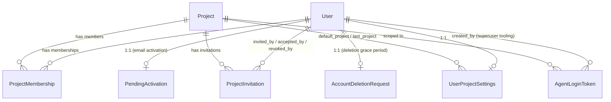
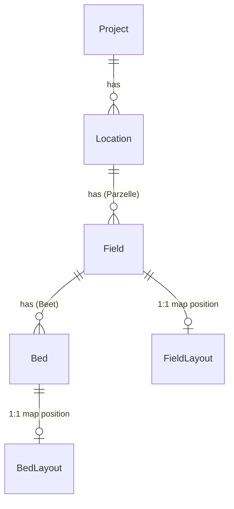
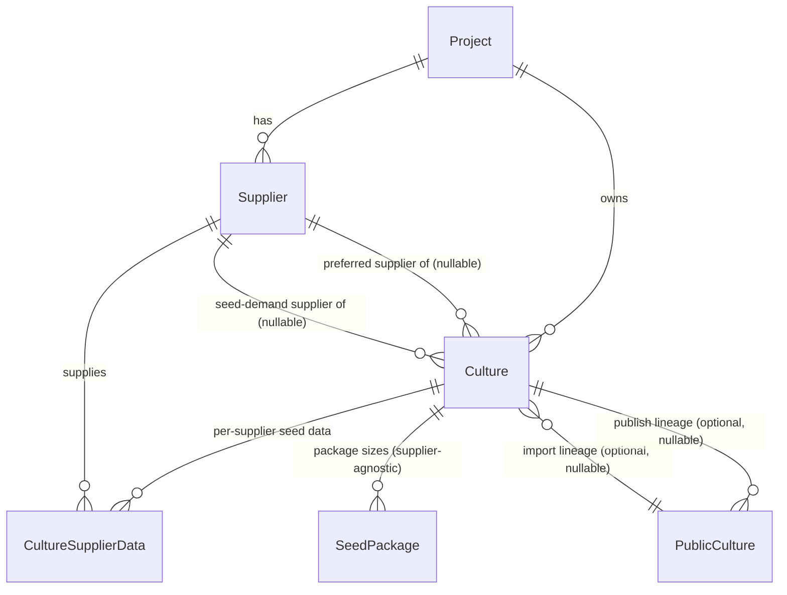
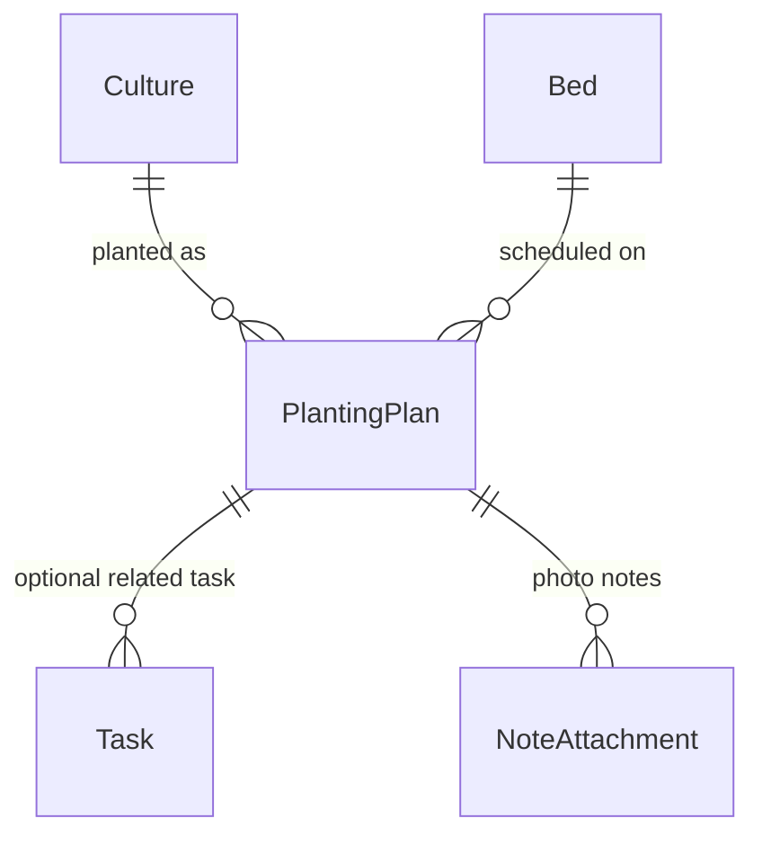
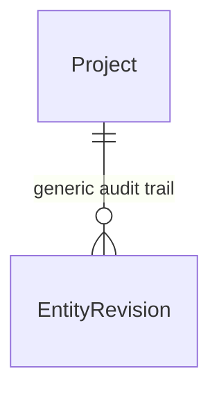

# Data Model Overview

This is a conceptual map of OpenFarmPlanner's core Django models
(`backend/farm/models/`, `backend/accounts/models.py`) and how they relate.
It is **not** a full field reference — see the model source for exact fields,
`help_text`, and validation. The goal here is to help you reason about which
objects exist, how they're connected, and which relationships matter for
typical features (a new column on the planting-plan grid, a new report, a
permission check, ...).

For the frontend/backend split and general architecture, start at
[architecture-overview.md](./architecture-overview.md).

## 1. Projects, users, and access

Every piece of farm data belongs to exactly one `Project` — projects are the
tenant boundary. A `User` (Django's built-in auth `User`, no custom user
model) gets access to a project only via a `ProjectMembership` row.

- **`ProjectMembership.role`** is either `admin` or `member` — this is the
  *entire* permission model. There is no per-object or field-level
  permission system, no "read-only" role. Ordinary CRUD on farm data
  (locations, fields, beds, cultures, planting plans, tasks, ...) only
  requires *any* membership; a short list of destructive/irreversible or
  membership-changing actions (delete/restore project, change a member's
  role, remove a member, send invitations, restore-from-history) requires
  the `admin` role — enforced in view code (`require_project_admin()` in
  `backend/farm/project_context.py`), not a DB constraint.
- Every API request that touches project-scoped data must send an
  `X-Project-Id` header; `ProjectScopedMixin` (`backend/farm/common/mixins.py`)
  resolves and validates it once per request (`initial()`), then
  auto-filters `get_queryset()` by `project=request.active_project` for any
  model that has a `project` field, and auto-injects `project` on create.
  This is the actual multi-tenancy enforcement point — see
  [architecture-overview.md](./architecture-overview.md#project-user-and-permission-model)
  for the full request-time flow.
- **Unclear / needs check**: the invariant "a project always has at least
  one admin" is enforced only in `ProjectMembersView` view logic, not at the
  database level.

## 2. Farm structure: locations → fields → beds

- `Location` → `Field` → `Bed` is a strict three-level physical hierarchy
  ("Standort" → "Parzelle" → "Beet" in the UI). Only *area* (`area_sqm`) is
  stored for fields/beds today, no polygon geometry — see
  `FIELD_BED_AREA_IMPLEMENTATION.md` for the historical rationale and the
  intended future geometry extension path.
- `BedLayout`/`FieldLayout` hold persisted x/y coordinates for the
  graphical/map layout view (`GraphicalFields.tsx`) — they're optional,
  separate rows from `Bed`/`Field` themselves, not embedded fields.
- `Field`, `Bed`, and most other project-scoped models below also carry a
  **direct, denormalized `project` FK** in addition to their natural parent
  (e.g. `Bed.project` in addition to `Bed.field`). This is deliberate — it's
  what lets `ProjectScopedMixin` filter *any* scoped model uniformly by
  `project`, without walking the parent chain. Don't treat it as redundant
  data to clean up.

## 3. Crop / culture domain and the seed supply chain

- **`Culture`** is project-owned: every project has its own private copy of
  every variety it grows, including growing parameters and history. It's
  soft-deletable (`deleted_at`); the default manager (`objects`) hides
  soft-deleted rows, `all_objects` doesn't (used by restore flows).
- **`PublicCulture`** is the shared, cross-project "crop library" — it has
  no owning `Project`, only optional *provenance* links back to the project
  and culture it was published from. See
  [crop-library-architecture.md](./crop-library-architecture.md) for the
  full story of how this split is formalized into the `crops` Django app.
- **`CultureSupplierData`** is the join between one `Culture` and one
  `Supplier`: supplier-specific product data (price, packaging sizes,
  germination rate, thousand-kernel-weight). `SeedPackage` is a simpler,
  supplier-agnostic "this culture comes in these package sizes" record.
  `Culture.selected_seed_demand_supplier` is a *separate* nullable FK from
  `Culture.supplier` (the general "preferred supplier") — it specifically
  drives which supplier's data feeds the Seed Demand calculation. See
  [seed-demand-calculation.md](./seed-demand-calculation.md) for how these
  pieces combine into an actual quantity.

## 4. Planning and operations

- **`PlantingPlan`** is the central operational record: one culture, on one
  bed, with a planting date and computed harvest date(s). It drives the
  Gantt/occupancy calendar, the seed demand view, and the yield overview.
- There is no separate `Note` model. Free-text notes are plain `notes` text
  fields directly on `Location`, `Field`, `Bed`, `Culture`,
  `CultureSupplierData`, `PublicCulture`, and `PlantingPlan`.
  `NoteAttachment` only stores *photo attachments*, and only for
  `PlantingPlan` — see
  [datagrid-architecture.md](./datagrid-architecture.md#notes--markdown-cells)
  for how these render as rich markdown+photo notes in the grid.

## 5. History and versioning

`EntityRevision` is the current, generic history mechanism: one row per
mutation of *any* trackable entity (`entity_type` + `object_id`, a full
JSON `snapshot`, and a diff-style `changed_fields` list). It superseded two
now-deprecated, drain-only models, `CultureRevision` and `ProjectRevision`
(culture-only and whole-project-JSON-blob designs that didn't scale). See
[versioning-and-history.md](./versioning-and-history.md) for how this
powers project history and restore.

## Unclear / needs check

- The exact session lifecycle of `AgentLoginToken` (how `agent_mode` /
  `agent_project_id` get set in the session on token consumption) wasn't
  traced end-to-end while writing this doc.
- Whether any code path other than `require_project_admin()` gates
  behavior by role — a full audit of every view wasn't performed.
