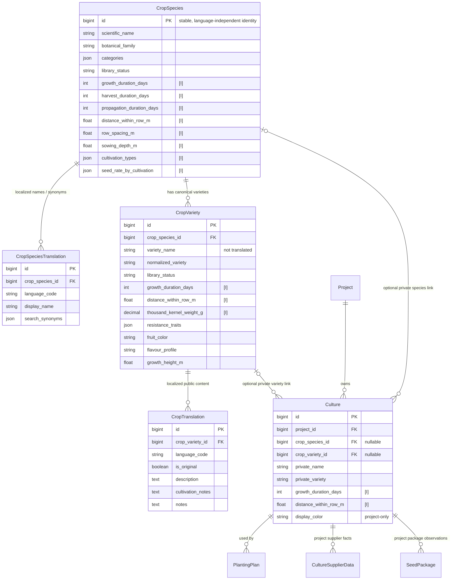

# International Public Crop Library: Target Data Model and Migration Plan

Date: 2026-07-22<br>
Status: architecture decision record and migration plan. The first
publishing-boundary slice now exists: `CropSpecies`, optional private
`Culture.crop_species`, `PublicCulture.crop_species`,
`PublicCulture.original_language_code`, and the Publishing Wizard. The
larger variety/translation migration remains future work.

## 1. Scope and current-state analysis

This plan evolves the existing shared `PublicCulture` library into a
language-independent, international crop library without forcing private
project data into the same lifecycle. It complements
[`crop-library-architecture.md`](./crop-library-architecture.md): the earlier
document establishes the library/planning boundary, while this document
specifies the future data model behind that library.

### Current model

Today the project has two independent record types plus the first official
species identity table:

- `Culture` is a project-owned record. It combines a user-entered crop name,
  variety, growing defaults, project supplier data, packages, display choices,
  and public-library import provenance.
- `PublicCulture` is a shared record. It currently copies the same name,
  variety, free text, growing, and seed fields into one language-specific row.
  New publications also store `crop_species` and `original_language_code`.
  The Publishing Wizard duplicate check uses official `crop_species` plus
  normalized `variety` (and supplier text in the bridge where relevant). Legacy
  public rows without `crop_species` remain readable.
- `CropSpecies` is the official species list. It is nullable on private
  cultures so project work stays flexible, but it is required by the
  publishing quality gate.

`CultureSupplierData` and `SeedPackage` are project-owned child records.
`PlantingPlan` intentionally points to the private `Culture` snapshot, not to
public data. This protects completed planning from later library edits.

### Consequences

The model has the right high-level ownership split, but its public identity,
localized content, and defaults are conflated in `PublicCulture`. The target
must therefore introduce a stable species identity and translation rows rather
than treating a translated display name as an identifier.

## 2. Recommended target architecture

### 2.1 Canonical identity

Introduce **`CropSpecies`** as the language-independent botanical/agronomic
identity, with an immutable surrogate primary key. Its ID is the only identity
used to mean “tomato”, “carrot”, or another crop species. A name, synonym,
locale, display ordering, or URL slug must never be used as that identity.

The public central list is the set of `CropSpecies` rows with
`library_status='published'`. It starts with the species relevant to
German-speaking vegetable production and can grow internationally without any
project dependency.

Introduce **`CropVariety`** as the language-neutral official variety record.
It belongs to exactly one `CropSpecies`; its `variety_name` is stored once and
is not translated. `normalized_variety` is a deterministic normalized form of
that name. The public duplicate key is:

```text
(crop_species_id, normalized_variety)
```

The unique constraint must apply to active/published canonical varieties. A
separate `library_status` supports non-destructive moderation states such as
`draft`, `published`, `hidden`, `removed`, and `needs_review`; hidden or
removed rows remain auditable but are excluded from normal discovery. Empty
variety names must not be used as an accidental universal “species-only
variety”; represent a species-only public entry deliberately, either with a
separate `CropSpeciesProfile` or a documented single null-variety convention.
The recommended first implementation is a nullable `variety_name` plus a
partial uniqueness constraint on `crop_species_id` where it is null.

### 2.2 Translatable data

Use two translation tables:

- **`CropSpeciesTranslation`**: localized species display names and search
  synonyms. `display_name` is the label; synonyms are search aliases only and
  never create another `CropSpecies`.
- **`CropTranslation`**: localized free text for an official `CropVariety`,
  such as description, cultivation guidance, and notes intended for public
  reuse. It also records the content language and whether it is the original.

`language_code` must be a validated, normalized BCP 47 language tag (for
example `de`, `en`, `sl`, and later `pt-BR`), stored in a canonical lowercase
form according to the project's chosen normalization rule. Do not model
languages as fixed Django choices: new languages must be data additions.

Constraints:

- unique (`crop_species_id`, `language_code`) on `CropSpeciesTranslation`;
- unique (`crop_variety_id`, `language_code`) on `CropTranslation`;
- at most one `CropTranslation.is_original=True` per `CropVariety` (partial
  unique constraint); and
- a published `CropVariety` must have at least one `CropTranslation`, enforced
  by service validation/transactional publishing rather than an impractical
  cross-row database constraint.

`is_original` applies to the public content record, not to a language as a
whole. It marks the source language of a particular variety's text. If a
translation is later replaced, it remains the original only if it is still the
source text; otherwise an audited editorial action must move the flag. This
is clearer than duplicating `original_language_code` on every translation.

Do not put a generic, schemaless “translated fields” JSON object on a
translation row. Explicit nullable columns (`description`, `cultivation_notes`,
`notes`) make validation, APIs, search, future editorial review, and targeted
updates reliable. Add a new nullable column only when a future user-visible
free-text field is introduced.

### 2.3 Defaults and simple overrides

`CropSpecies` owns the species baseline. `CropVariety` stores nullable
overrides. `Culture`, the project-owned planning record, stores nullable
overrides. The effective value is simply:

```text
Culture project value ?? CropVariety value ?? CropSpecies value
```

where `NULL` means “inherit the next higher default.” There is no dynamic
rules engine, merge strategy, or per-field inheritance table. A small,
well-tested resolver service or explicit query annotation may expose effective
values for a known list of fields. Persisted planting-plan harvest dates stay
snapshots: recalculation only happens through an explicit existing planning
operation, never merely because a library default changed.

The hierarchy only applies when a private `Culture` is linked to an official
`CropVariety`. A free-text private culture with no link remains valid and uses
only its own values.

## 3. Entity relationships

`[I]` marks fields participating in the simple inheritance chain. `NULL` at a
lower level means inherit. The diagram shows target relationships, not a
Django migration to apply now.



## 4. Attribute placement

The following classification covers every current `Culture` and
`PublicCulture` field, plus their crop-adjacent child records. “Default” in
Groups A/B describes the target public-library data, not mandatory values.

### Group A — species only

| Current attribute | Target location | Reason |
|---|---|---|
| `name`, `name_normalized` | `CropSpeciesTranslation.display_name` and normalized search index | Names depend on locale and are not the identity. |
| New scientific name | `CropSpecies.scientific_name` | Stable botanical metadata independent of locale. |
| `crop_family` | `CropSpecies.botanical_family` | A family belongs to the species, not a commercial variety or a project. |
| New categories | `CropSpecies` / normalized category relation later | Crop categories are taxonomy/discovery metadata. Start with a controlled field/relation, not translated names on varieties. |
| Species synonyms | `CropSpeciesTranslation.search_synonyms` | Search and autocomplete aliases only; never identity. |
| `nutrient_demand` | `CropSpecies` | A useful rotation baseline is species-level. A project-specific rotation decision should be a future explicit override only if a real use case appears; it should not silently become variety marketing data. |

### Group B — inheritable defaults

The following fields must be nullable on `CropSpecies`, `CropVariety`, and
private `Culture` where they exist today. A variety value is a refinement of
the species baseline; a private culture value is a project-specific override.

| Attributes | Target treatment | Reason |
|---|---|---|
| `cultivation_types`, deprecated `cultivation_type` | baseline/override; retire the single field after compatibility migration | A variety and local method can differ, while the species supplies the normal options. |
| `growth_duration_days`, `harvest_duration_days`, `propagation_duration_days` | baseline/override | Cultivar and local season can materially change timing. |
| `harvest_method`, `expected_yield` | baseline/override | The common method/yield can be species-based but variety and local practice differ. `expected_yield` needs a documented unit before central publication. |
| `distance_within_row_m`, `row_spacing_m`, `sowing_depth_m` | baseline/override | Exactly the requested agronomic defaults; stored in SI units. |
| `seed_rate_value`, `seed_rate_unit`, `seed_rate_by_cultivation` | baseline/override | Rates depend on species, variety, and local equipment/practice. Prefer the structured per-cultivation field; treat the legacy pair as compatibility data until retired. |
| `sowing_calculation_safety_percent` and direct/pre-cultivation variants | baseline/override | A sensible default may exist, but germination expectations and local risk justify overrides. |
| `thousand_kernel_weight_g` | default/override | It is often variety-specific, but an unknown variety needs a species baseline; supplier measurements may additionally override it locally. |
| `seeding_requirement`, `seeding_requirement_type` | baseline/override, but review semantic unit before centralizing | Current semantics are ambiguous (“total” without an area/time basis), so preserve existing data and clarify it before making it a library recommendation. |
| `allow_deviation_delivery_weeks` | project-only for now; do **not** inherit | This is a planning workflow preference, not botanical or variety knowledge. |

### Group C — variety only

| Attribute | Target location | Reason |
|---|---|---|
| `variety`, `variety_normalized` | `CropVariety.variety_name`, `normalized_variety` | A cultivar designation is language-neutral and identifies the canonical variety under a species. |
| Resistance | new structured `CropVariety` trait/relation | Cultivar characteristic; use controlled trait codes rather than localized prose when it drives filtering. |
| Fruit/root/leaf color | new `CropVariety` trait | Cultivar characteristic. |
| Flavour/taste | new `CropVariety` trait or localized `CropTranslation` prose | Keep filterable standardized traits separate from explanatory text. |
| Growth height/habit | new `CropVariety` trait | Cultivar characteristic; only make it inheritable if planning later uses it as a numeric default. |
| Public description, cultivation guidance, public notes | `CropTranslation` | These are language-dependent content for a canonical variety. |

### Private project data that remains private

| Current attribute/record | Target treatment | Reason |
|---|---|---|
| `Culture.project`, soft deletion, history, origin/source version, modified flag | remain on `Culture` | Tenant lifecycle and import provenance are not public-library concerns. |
| `Culture.name`, `variety`, normalized fields | retain as `private_name`, `private_variety` during transition; may remain denormalized labels | Needed for free text, historical snapshots, and low-risk gradual migration. When linked, display normally comes from the resolved public translations but private labels are not overwritten. |
| `notes` on `Culture` | remains project-local | Farm observations must not become public text or translations. |
| `seed_supplier`, `supplier`, `selected_seed_demand_supplier`, `supplier_product_url`, `CultureSupplierData` | remain project-owned | Supplier availability, prices, germination, product URLs, and selection are local/commercial facts. A future public supplier-offering model requires its own provenance and update policy. |
| `SeedPackage` / public `seed_packages` JSON | retain project package observations; do not copy to canonical variety | Package sizes and availability vary by supplier, market, and time. |
| `image_file` | remains project-owned until rights/provenance are designed | A public image needs separate licensing, attribution, moderation, and localized alt text. |
| `display_color` | remains project-owned | Calendar color is UI preference. |
| `allow_deviation_delivery_weeks` | remains project-owned | Project planning behavior. |
| `PlantingPlan` dates, quantity, area, notes, cultivation type | remain project-owned snapshots | Operational history must not change when a shared record changes. |

## 5. Translation lookup and fallback

The requested fallback is sound as a deterministic baseline:

1. exact user-preferred language;
2. English (`en`);
3. the row marked `is_original=True`;
4. a deterministic first available translation.

Two refinements make it robust internationally:

- Before step 1, try the language-only match for a regional preference. For
  `pt-BR`, try `pt-BR`, then `pt`; do not make a region fallback cross into a
  different base language automatically.
- “First available” must be deterministic, for example lowest normalized
  `language_code`, not database insertion order. Return the resolved language
  in the API so the UI can say content is shown in another language if that
  becomes useful.

Species names should use the same resolver, but they do not need
`is_original`; their final fallback may be the scientific name when no display
translation exists. English is a practical international bridge but must never
block publication in another original language.

## 6. Private-project recommendation

Recommend **Variant B**:

- autocomplete against `CropSpecies` (and, after species selection,
  `CropVariety`) makes the canonical identity discoverable early;
- free text stays allowed, so private projects retain today's flexibility,
  imports, rare crops, experiments, and historical records; and
- publishing requires mapping to one official `CropSpecies` and, for a named
  cultivar, an official `CropVariety` or a reviewed proposal to create one.

This delivers data quality at the public boundary without turning private
planning into a constrained catalogue editor. Variant A postpones mapping until
publication and therefore produces more costly ambiguous matching precisely at
the point where permanent shared data is created.

## 7. Concrete phased migration plan

No backfill should be bundled with the first schema release. Every phase is
reversible or additive until the final cleanup phase.

### Phase 0 — decisions and inventory

1. Adopt this model and the language-tag normalization policy.
2. Curate the initial German-speaking vegetable `CropSpecies` seed list with
   stable IDs, scientific names where known, German and English translations,
   and controlled category/family values.
3. Define editorial ownership, moderation statuses, source attribution, and
   the meaning/unit of `expected_yield` and `seeding_requirement`.
4. Produce a dry-run mapping report from existing `PublicCulture` and private
   `Culture` rows: exact normalized pairs, ambiguous names, blank varieties,
   spelling variants, and supplier-only differences. Do not mutate data.

### Phase 1 — additive public schema

Create new tables (initially in the `crops` app through a carefully planned
Django state/database migration, keeping existing `farm_publicculture`
untouched):

- `CropSpecies`;
- `CropSpeciesTranslation`;
- `CropVariety`;
- `CropTranslation`.

Add nullable `crop_species` and `crop_variety` foreign keys to `Culture`.
Add nullable provenance links from `CropVariety`/`CropTranslation` to legacy
`PublicCulture` only if needed for audit and idempotent backfill; otherwise
record legacy IDs in an import ledger. Add indexes for species status,
translation lookup, and `(crop_species, normalized_variety)`.

Existing tables that remain unchanged in this phase: `Culture`,
`PublicCulture`, `CultureSupplierData`, `SeedPackage`, `PlantingPlan`,
`Supplier`, and history tables. Existing APIs/UI continue to use them.

### Phase 2 — seed and backfill the public library

1. Insert the curated species and translation seed data with stable primary
   keys or stable import identifiers.
2. Map each legacy published row to a canonical species using a reviewed,
   version-controlled mapping table. Never infer ambiguous multilingual names
   silently.
3. Group mapped legacy rows by `(crop_species_id, normalized_variety)`.
   Create one `CropVariety` per group and one `CropTranslation` for each
   distinct language/content contribution. Mark the source row language as
   original where known; where unknown, import it as `und` only after editorial
   review, not by guessing German.
4. Copy public free text into the relevant translation. Copy inherited numeric
   fields first to the variety; promote a value to the species only after
   editorial review confirms it is a species baseline.
5. Preserve legacy `PublicCulture` rows and their provenance/version data.
   Record mapping, conflicts, and merge decisions in an import ledger; do not
   delete duplicate legacy rows.

The old `name + variety` and supplier-sensitive duplicate detector stays in
place for the legacy publish path until the new public write path is live.

### Phase 3 — link private cultures without rewriting them

For each `Culture`, populate nullable links only where the mapping is
unambiguous. Keep all existing private fields exactly as stored. Do not merge
cultures across projects, discard supplier distinctions, or alter planting
plans. Unmapped cultures remain valid free text.

At this stage a resolver may offer effective defaults only for newly linked
cultures. Existing non-null project values continue to win, so behavior is
stable. `NULL` project values can begin inheriting only behind an explicit,
tested compatibility decision, because some current nulls may mean “unknown”
rather than “use a library recommendation.”

### Phase 4 — new write/read paths

Introduce a versioned crop-library API that returns canonical IDs, requested
and resolved language, translations, and effective defaults. Change public
publication to require an official species and enforce the new canonical
unique key. Add Variant B autocomplete while retaining free text. Keep legacy
endpoints read-only or compatibility-only until clients are migrated.

### Phase 5 — controlled retirement

After usage telemetry, reconciliation, and a published deprecation window:

- stop creating new `PublicCulture` records;
- migrate public-library read traffic to the new tables;
- remove legacy duplicate logic only after all public writes use canonical
  identity; and
- retain the old table as an archived/import-audit source for a defined period
  before any destructive migration. A model/table move between Django apps
  must use `SeparateDatabaseAndState` or an equally reviewed operation.

## 8. Open decisions and risks

### Decisions still required

- Whether a `CropVariety` is created immediately on community publication or
  enters `needs_review`; the recommended default is review for a new canonical
  variety, immediate translation additions for an existing one.
- The initial authoritative taxonomy source and its license, including how
  scientific names and categories are curated.
- Whether species-only records use nullable variety names or a dedicated
  species-profile table. Choose one before Phase 1 and document it in API
  contracts.
- The controlled vocabulary/data model for categories, resistances, colours,
  and growth habit; start small rather than freezing unvalidated enum lists.
- Content licensing/attribution/revision rules for translations, and whether
  editors can change an original-language flag.
- Whether public varieties need a separate public image model with rights,
  author, license, and localized alternative text.

### Primary risks and mitigations

| Risk | Mitigation |
|---|---|
| Incorrect mapping merges distinct species or varieties | Reviewable mapping report, import ledger, no automatic ambiguous merge, and non-destructive legacy retention. |
| Existing `NULL` values change planning behavior once they inherit | Enable inheritance only for newly linked/opted-in data first; preserve current values and test calculations. |
| Duplicate varieties due to spelling, trademark, or breeder suffixes | Normalize conservatively, use aliases/editorial review, and keep a canonical variety record rather than fuzzy auto-merge. |
| Translation quality or stale content | Per-language revision/audit metadata, original marker, moderation, and explicit resolved-language response. |
| Public supplier/package data becomes stale or legally problematic | Keep it private; design a source-aware offering model separately if later needed. |
| Django app/table move damages production data | Add new tables first; defer moves and use reviewed state/database separation. |

## 9. Recommended implementation order

1. Approve the unresolved decisions, especially taxonomy source, moderation,
   language tags, and the species-only convention.
2. Add schema and constraints with focused model/migration tests, but no
   backfill or UI change.
3. Build the curated species seed dataset and the dry-run mapping/audit tool.
4. Backfill and review public data; retain legacy rows and provenance.
5. Add private nullable links and the tested effective-value resolver.
6. Release the read-only multilingual API and Variant B autocomplete.
7. Move publication to the canonical write path and enforce duplicate rules.
8. Deprecate `PublicCulture` only after verified client migration and a
   production reconciliation period.
