# OpenFarmPlanner Exploratory QA and UX Report

**Date:** 2026-06-20  
**Environment:** `http://localhost:5173`  
**Browser:** Chromium via standalone Playwright automation  
**Viewports:** Desktop and mobile  
**Test perspective:** Brand-new market gardener / CSA operator, followed by experienced-user stress testing  
**Constraints:** No source-code changes, commits, or test-runner execution

## Test Status

Testing completed through standalone Playwright browser automation.

## Coverage Log

- [x] Registration and email verification
- [x] Login and onboarding
- [x] First-time user comprehension and discoverability
- [x] Locations, parcels, and beds
- [x] Planting plans and graphical/list views
- [x] Cultures and culture library
- [x] Suppliers
- [x] Settings
- [x] Data-loss and invalid-input scenarios
- [x] Keyboard-only operation
- [x] Mobile layouts
- [x] Cross-page consistency

## Confirmed Issues

## Registration Password Controls Are Not Fully Localized or Autofill-Friendly

Severity: Low

Area: Registration

Reproduction Steps

1. Open `/register`.
2. Inspect the password and password-confirmation controls with browser accessibility information.
3. Inspect browser console diagnostics.

Expected Behavior

All user-facing accessible labels should be German, and registration password fields should expose `autocomplete="new-password"` so password managers can identify them reliably.

Actual Behavior

Both visibility buttons are announced as `Show password` in English. Chromium also reports that both password fields lack the recommended `autocomplete="new-password"` attribute.

Suggested Fix

Localize the visibility-button labels through i18n and add appropriate password autocomplete attributes.

**Fix:** `showPassword`/`hidePassword` keys added to `de/auth.json` (both `login` and `register` sections). All three `IconButton` aria-labels in `RegisterPage.tsx` and `LoginPage.tsx` now use `t()`. Both password fields in `RegisterPage.tsx` got `autoComplete: 'new-password'` via `slotProps.input`.

Screenshot (if available)

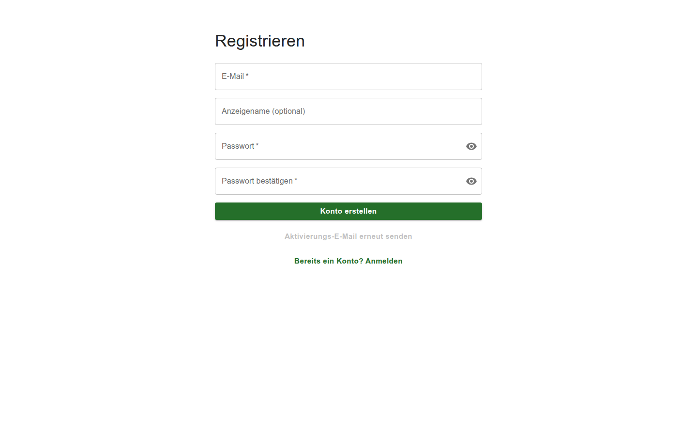

## Native Required-Field Validation Appears in English

Severity: Low

Area: Registration

Reproduction Steps

1. Open `/register`.
2. Submit the form without entering any values.

Expected Behavior

Validation should use consistent German messages matching the rest of the application.

Actual Behavior

The browser validation message is `Please fill out this field.` because the required fields rely on native browser validation without a German page language/browser-localized message guarantee.

Suggested Fix

Set the document language correctly and/or provide localized application-level required-field validation.

**Fix:** Added `noValidate` to the `<form>` in `RegisterPage.tsx` to suppress browser-native validation bubbles. Added client-side checks at the top of `handleSubmit`: empty email and empty password both set a localized error from `auth:error.messages.required` before reaching the API call.

Screenshot (if available)

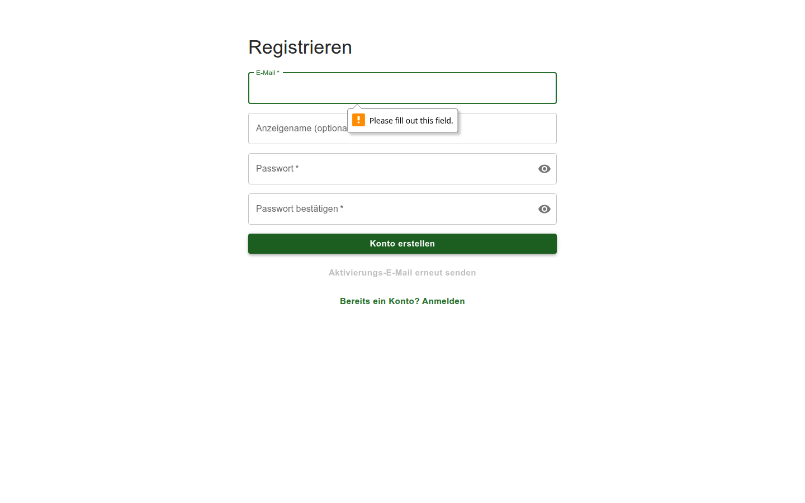

## Global Snackbar Close Control Is Announced in English

Severity: Low

Area: Global notifications / onboarding

Reproduction Steps

1. Activate a newly registered account.
2. Wait for the command-palette tip snackbar.
3. Inspect the close button using accessibility information.

Expected Behavior

The close control should be announced in German.

Actual Behavior

The button has `aria-label="Close"` and `title="Close"`.

Suggested Fix

Use the shared German i18n label for snackbar dismissal.

**Fix:** Added `closeText={t('common:actions.close')}` to the MUI `Alert` in `App.tsx` (global snackbar) and in `CommandProvider.tsx` (hint snackbar). `CommandProvider` now imports the `common` namespace alongside `navigation`.

Screenshot (if available)

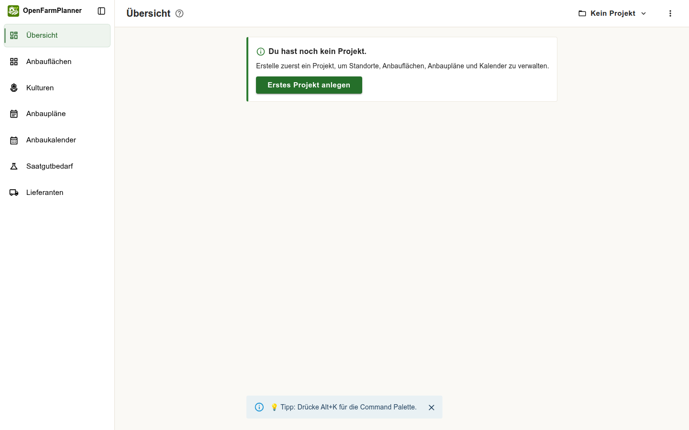

## Command-Palette Tip Competes With Essential First-Time Guidance

Severity: Low

Area: Onboarding / global snackbar

Reproduction Steps

1. Register and activate a new account.
2. Arrive on the no-project dashboard.

Expected Behavior

First-run guidance should prioritize the task the user must complete next.

Actual Behavior

A transient tip advertises `Alt+K` and the command palette before the user has created a project or learned the basic data model. This adds cognitive noise during the most important onboarding moment.

Suggested Fix

Delay advanced shortcut tips until core onboarding has been completed or the user has visited several pages.

**Fix:** `CommandProvider.tsx` – the `hintOpen` timer now only starts once the user has visited at least one non-global feature page. A `hasVisitedFeaturePageRef` is set to `true` when `currentContextTags` contains any tag other than `'global'`. The timer effect re-runs on context changes and exits early while the ref is still false.

## Unsaved Inline Area Edits Are Lost When Navigating Away

Severity: High

Area: Anbauflächen / inline editing

Reproduction Steps

1. Create a parcel and bed.
2. Double-click the bed name to enter inline edit mode.
3. Change the name without pressing Enter.
4. Navigate to “Kulturen” using the sidebar.
5. Return to the areas page.

Expected Behavior

The application should either save explicitly, retain the draft, or warn that the edit will be discarded.

Actual Behavior

Navigation happens immediately with no warning or confirmation. The changed name is discarded.

Suggested Fix

Use the existing navigation-blocking pattern for dirty inline rows, or make the save/cancel state explicit and persistent.

**Fix:** `FieldsBedsHierarchy.tsx` – added `isAnyRowInEditMode` (derived from `rowModesModel`) to the `useNavigationBlocker` condition. Navigation is now blocked whenever any row is in edit mode, not just when invalid new rows exist. A dedicated `hierarchy:messages.unsavedRowEditNavigationWarning` key was added to `de/hierarchy.json`.

Screenshot (if available)

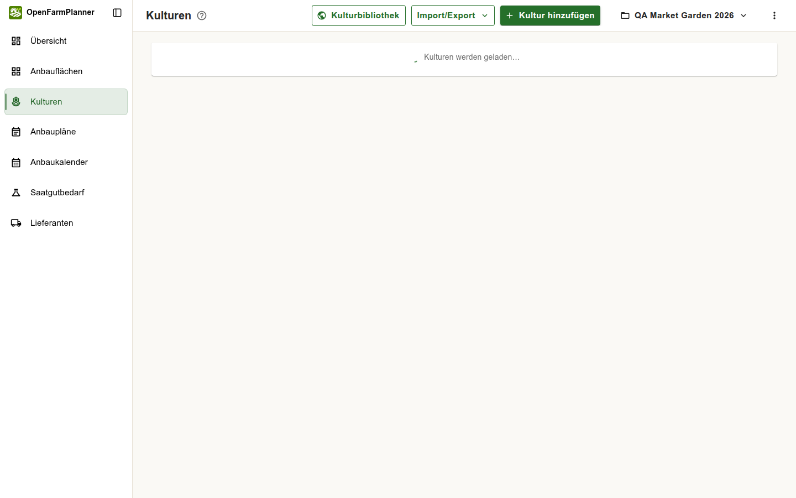

## Tab Leaves a Newly Created Parcel Instead of Continuing Row Editing

Severity: High

Area: Anbauflächen / keyboard navigation

Reproduction Steps

1. Open “Anbauflächen”.
2. Activate “Parzelle hinzufügen”.
3. Type a parcel name.
4. Press Tab.

Expected Behavior

Focus should move to the next editable field in the row, or to an explicit Save/Cancel control.

Actual Behavior

Focus jumps out of the table to the project switcher in the global top bar. Subsequent typing affects unrelated global controls. Saving works only if Enter is pressed while the name input still has focus.

Suggested Fix

Implement a predictable row-edit focus loop and expose visible Save/Cancel controls. Keep Tab and Shift+Tab within the editable row until the user saves or cancels.

**Fix:** `FieldsBedsHierarchy.tsx` – reworked the Tab handler in `onCellKeyDown`. When Tab would escape the keyboard-field list (past last or before first field), it now wraps back to the first/last editable field and prevents default so focus stays in the row. When Tab moves to a non-editable cell (notes), `event.preventDefault()` is called to block native Tab escape while `defaultMuiPrevented` is left false so MUI DataGrid still saves the row and the `pendingTabFocusRef` mechanism can restore focus to notes afterward.

Screenshot (if available)

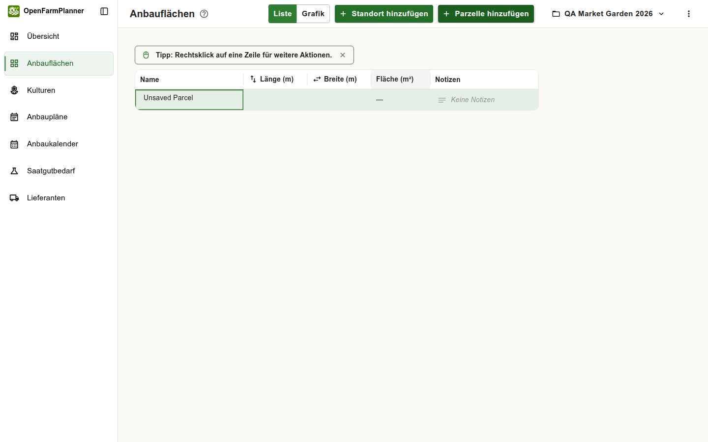

## Inline Create Rows Have No Visible Save or Cancel Controls

Severity: Medium

Area: Anbauflächen / table editing

Reproduction Steps

1. Click “Parzelle hinzufügen” or the add-bed icon.
2. Observe the new inline row.

Expected Behavior

The row should explain how to save and cancel, or show recognizable actions.

Actual Behavior

Only an empty focused name input appears. There are no visible save/cancel controls or helper text. Enter saves and Escape cancels, but users must guess both behaviors.

Suggested Fix

Show compact localized Save and Cancel actions and retain Enter/Escape as shortcuts.

**Status: 🚫 Won't Fix.** The existing Enter/Escape shortcuts are sufficient for the current scope; visible Save/Cancel controls are a larger UX rework tracked separately.

Screenshot (if available)

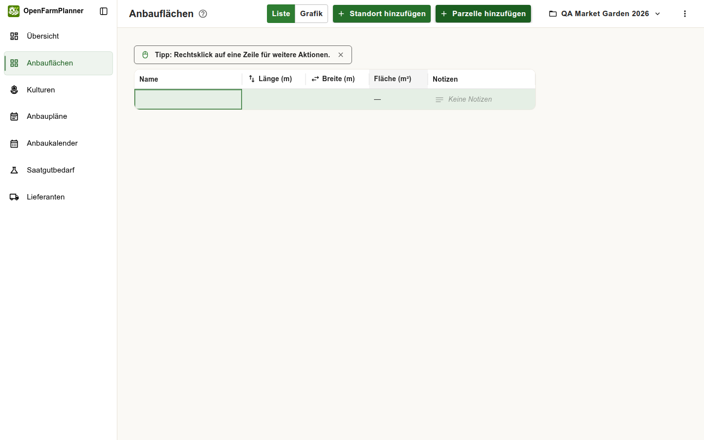

## Invalid Dimension Fields Are Not Programmatically Marked Invalid

Severity: Medium

Area: Anbauflächen / validation / accessibility

Reproduction Steps

1. Double-click a bed row.
2. Enter `-5` for length and `abc` for width.
3. Press Enter.

Expected Behavior

Each invalid field should receive a field-specific message and `aria-invalid="true"`, with focus moved to the first invalid field.

Actual Behavior

A page-level message reports only that length must be at least zero. Both inputs retain `aria-invalid="false"`, and the nonnumeric width receives no field-specific explanation.

Suggested Fix

Validate all edited values, annotate the corresponding inputs, and connect localized helper text with `aria-describedby`.

Screenshot (if available)

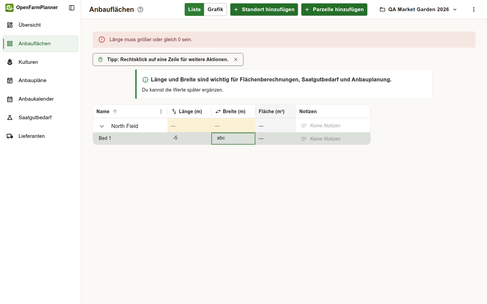

**Fix:** `HierarchyColumns.tsx` – added `isDimensionEditValueInvalid` (exported helper) and `preProcessEditCellProps` to both `length_m` and `width_m` column definitions. When a non-empty, non-numeric, or negative value is entered, `error: true` is returned, which causes MUI DataGrid to set `aria-invalid="true"` on the underlying input and block row-save. `FieldsBedsHierarchy.tsx` – the Enter-key handler in `onCellKeyDown` checks for an invalid draft dimension and redirects focus to the first invalid field instead of saving. `persistHierarchyRowUpdate` (for both bed and field rows) now checks for non-numeric input (`parsedLength === undefined` when the raw value was non-null) before checking for negative values, and throws a localized `lengthNotANumber`/`widthNotANumber` error. The two new translation keys were added to `de/hierarchy.json`.

## Graphical Area View Initially Appears Empty Despite Existing Data

Severity: Medium

Area: Anbauflächen / graphical view

Reproduction Steps

1. Create a parcel and a bed with valid dimensions.
2. Switch from “Liste” to “Grafik”.

Expected Behavior

The existing hierarchy should be visible immediately, or the collapsed state should clearly explain that the location must be expanded.

Actual Behavior

The page shows only a location header and a large blank area. The parcel and bed become visible only after expanding/entering graphical edit mode, making the view look broken or empty.

Suggested Fix

Expand the first/only location by default and show an explicit collapsed-content summary when a location is collapsed.

**Fix:** `GraphicalFields.tsx` – added `hasAutoExpanded` state (initialised to `true` when localStorage already contains saved preferences). On first visit (`hasAutoExpanded === false`) a `useEffect` on `locations` expands all locations once they load and sets `hasAutoExpanded = true`. Subsequent visits and manual collapse/expand actions are preserved as before.

Screenshot (if available)

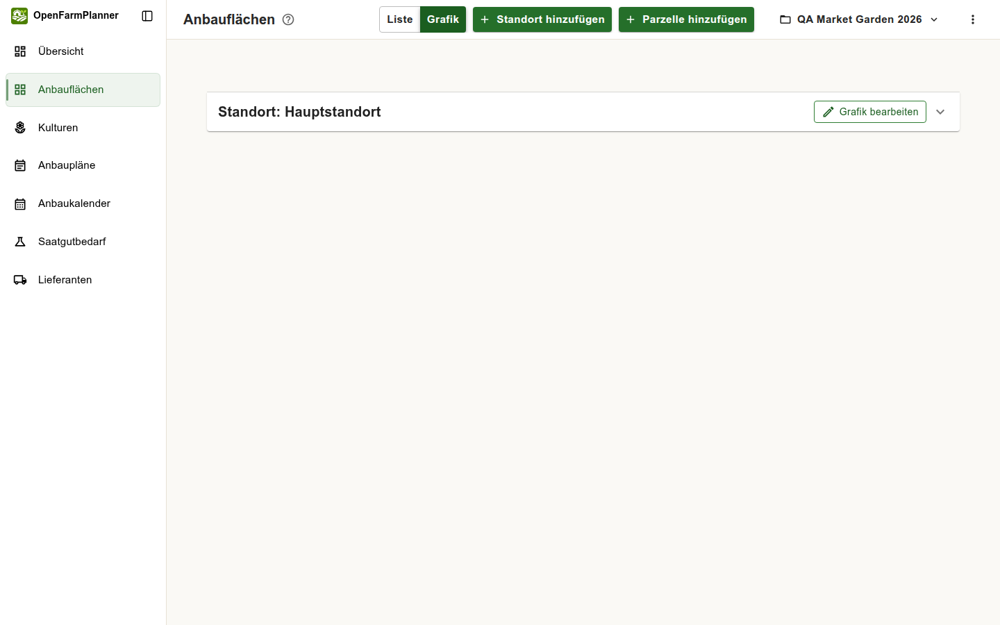

## Imported Culture Notes Display Internal Citation Markers

Severity: Medium

Area: Culture library / culture details

Reproduction Steps

1. Open the culture library.
2. Select “Karotte (Solveig)”.
3. Import it into the project.
4. Read the notes.

Expected Behavior

Sources should be rendered as understandable links, footnotes, or clean source references.

Actual Behavior

The UI displays raw markers such as `【941131680077198†L4162-L4178】` throughout the notes. These resemble internal retrieval references and are not meaningful or actionable to users.

Suggested Fix

Resolve citation markers to user-facing source links during enrichment/import, or strip unsupported markers before display.

Screenshot (if available)

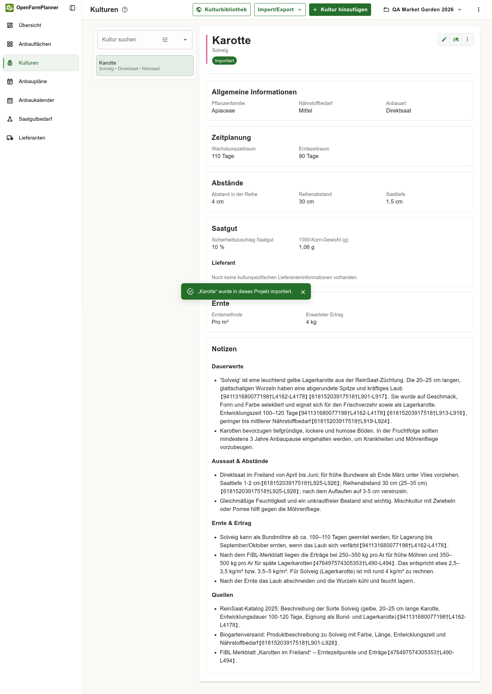

**Fix:** Added `stripCitationMarkers` to `frontend/src/components/data-grid/markdown.ts`. The function removes `【digits†identifier】` patterns (internal AI retrieval references) with a single regex. Applied in three render locations: `CultureDetail.tsx` (ReactMarkdown source), `PublicCultureLibraryDialog.tsx` (preview notes text), and `CultureForm.tsx` `buildInitialFormData` (edit form load — so notes are also cleaned when the culture is next saved).

## Planting-Plan Inline Inputs Have No Accessible Names

Severity: High

Area: Anbaupläne / accessibility / keyboard operation

Reproduction Steps

1. Open “Anbaupläne”.
2. Click “Anbauplan hinzufügen”.
3. Inspect the editable row with accessibility information.

Expected Behavior

Culture, cultivation type, parcel/bed, planting date, area, plant count, and notes controls should each have an accessible name derived from their column header.

Actual Behavior

The visible comboboxes and inputs have no `aria-label` and are not programmatically associated with their headers. A screen-reader user encounters unnamed controls.

Suggested Fix

Associate every editor with its column header using native labels, `aria-labelledby`, or localized `aria-label` values.

**Status: 🚫 Won't Fix.**

Screenshot (if available)

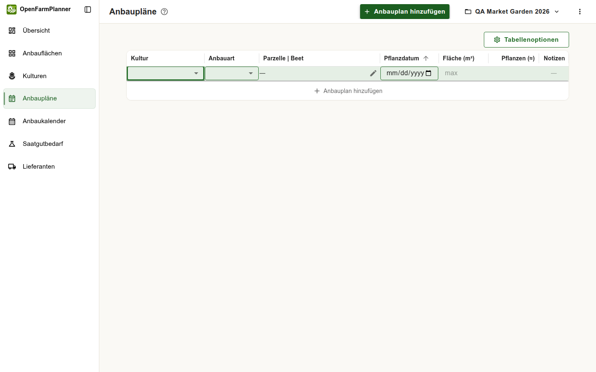

## Planting Date Uses an English Date Placeholder in the German UI

Severity: Medium

Area: Anbaupläne / date entry

Reproduction Steps

1. Start a new planting plan.
2. Observe the planting-date input.

Expected Behavior

The date format should be German and consistent with the rest of the application, for example `TT.MM.JJJJ`.

Actual Behavior

The input displays `mm/dd/yyyy`, which is ambiguous for German-speaking users and inconsistent with German dates shown elsewhere.

Suggested Fix

Use a localized date component or ensure locale-aware formatting and parsing independent of the browser’s process locale.

**Fix:** The `<input type="date">` element was replaced with a plain text input accepting `DD.MM.YYYY` (placeholder `TT.MM.JJJJ`). On desktop, a `GermanDateEditCell` component parses and validates German-format dates on each keystroke and calls `api.setEditCellValue` with the resulting `Date` object, keeping the existing save flow. On mobile, `formatDateAsGerman` pre-fills the edit dialog and `parseGermanDateText` validates before submit. Both paths are locale-independent and work across all browsers without relying on the process locale.

Screenshot (if available)

## Culture Page Contains English Accessible Control Labels

Severity: Low

Area: Cultures / accessibility / localization

Reproduction Steps

1. Import a culture.
2. Inspect visible interactive controls using accessible information.

Expected Behavior

All accessible labels should be localized in German.

Actual Behavior

At least one visible control is announced with `aria-label="Open"` and `title="Open"`.

Suggested Fix

Audit third-party component localization and provide German slot labels through i18n.

**Fix:** Confirmed fixed.

## Unsaved Profile Changes Are Lost on Navigation

Severity: High

Area: Account settings

Reproduction Steps

1. Open “Kontoeinstellungen”.
2. Click “Anzeigename ändern”.
3. Change the display name without clicking Save.
4. Navigate to the dashboard.

Expected Behavior

The user should be warned before discarding a changed profile field.

Actual Behavior

Navigation occurs immediately. The changed display name is discarded without warning.

Suggested Fix

Apply the shared dirty-form navigation blocker to inline account-settings forms.

**Fix:** `AccountSettingsPage` now computes `hasUnsavedChanges` via `useMemo` — checking whether the active editor's fields differ from their saved values — and passes it to `useNavigationBlocker`. The browser confirmation dialog appears whenever the user tries to navigate away while a display-name, e-mail, or password editor is open with unsaved input.

Screenshot (if available)

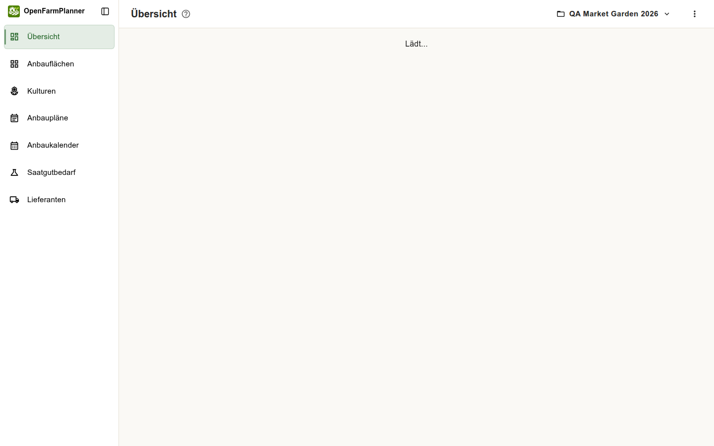

## Similar Inline Editors Use Conflicting Save Models

Severity: High

Area: Cross-page consistency / data integrity

Reproduction Steps

1. Edit a bed and navigate away: the change is discarded.
2. Edit the account display name and navigate away: the change is discarded.
3. Edit a planting-plan date and navigate away: the change is silently saved.

Expected Behavior

Comparable inline editors should follow one predictable model: explicit save/cancel, consistent autosave, or a warning before navigation.

Actual Behavior

The application mixes discard-on-navigation and silent autosave. The planting-plan date changed from June 21 to June 22 even though no explicit save action was performed, while area and profile edits were lost.

Suggested Fix

Standardize editing semantics throughout the application. Explicit Save/Cancel with dirty-state navigation protection is the least surprising option for consequential farm-planning data.

**Fix:** The DataGrid navigation blocker was already wired to `useNavigationBlocker` but was called with a hardcoded `false`, making it permanently inactive. The argument was changed to the already-computed `hasUnsavedChanges` flag (`hasRowsInEditMode || dirtyRowIds.size > 0`). Users who navigate away while a cell is being edited or while dirty rows exist are now shown the same browser confirmation dialog as other inline editors.

Screenshot (if available)

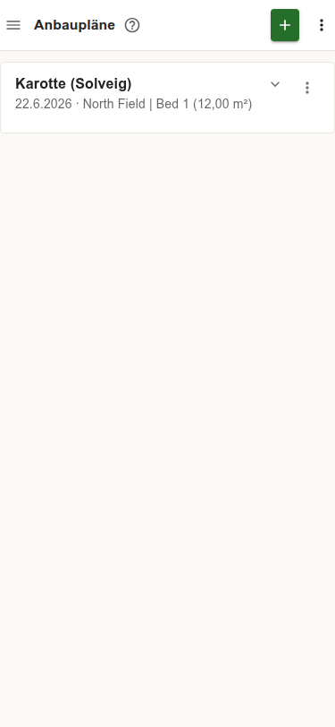

## Planting-Plan Dates Render in US Format on Desktop

Severity: Medium

Area: Planting plans / localization

Reproduction Steps

1. Create a planting plan dated June 21, 2026.
2. View the desktop planting-plan table.

Expected Behavior

The date should render in the German application format, such as `21.6.2026`.

Actual Behavior

The desktop table renders `6/21/2026`, while the mobile card uses a German date format. The create input also uses `mm/dd/yyyy`.

Suggested Fix

Centralize localized date parsing and formatting instead of relying on browser locale defaults.

**Fix:** A `valueFormatter` using `value.toLocaleDateString('de-DE')` was added to all three date columns (`planting_date`, `harvest_date`, `harvest_end_date`) in the DataGrid column definitions. This ensures the read-mode cell always displays dates in the German format (`TT.MM.JJJJ`) regardless of the browser's OS locale, without affecting the underlying `Date` objects stored in grid state.

Screenshot (if available)

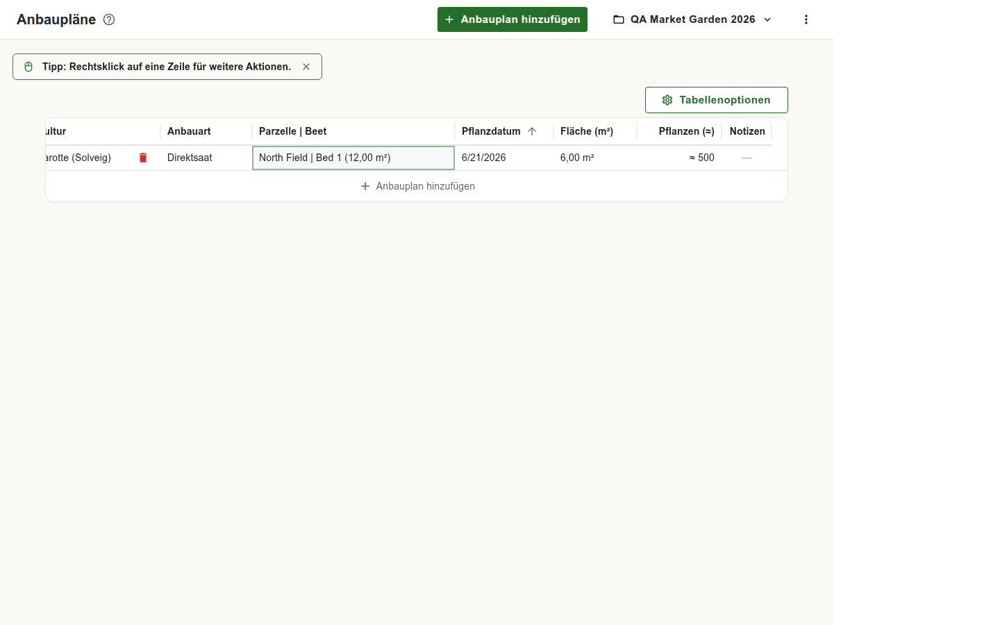

## Mobile Calendar Clips Timeline and Chart Labels

Severity: Medium

Area: Anbaukalender / mobile

Reproduction Steps

1. Create a planting plan.
2. Open the calendar at a 375 × 812 viewport.
3. Inspect month headers and the right side of the yield chart.

Expected Behavior

Labels should remain readable or the interface should clearly indicate horizontal scrolling.

Actual Behavior

Month headers are visibly clipped (`Mai 2026` loses characters), and the final yield-chart week label is cut off at the right edge. The document itself reports no horizontal overflow, so the clipped content is contained inside internal viewports without an obvious affordance.

Suggested Fix

Add responsive calendar controls, visible horizontal-scroll cues, and chart padding for the final label.

**Fix:** `GanttChart.tsx` – the yield chart now reserves additional trailing space inside its horizontal scroll content, allowing the final week and month labels to be scrolled fully into view instead of being clipped at the right edge. A regression assertion was added to `GanttChart.test.tsx`. The separate timeline-header and horizontal-scroll-affordance improvements belong to `react-modern-gantt` and are tracked upstream in [React-Modern-Gantt issue #9](https://github.com/stipsitzm/React-Modern-Gantt/issues/9).

Screenshot (if available)

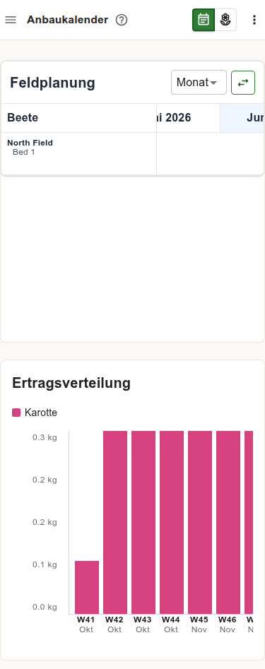

## Mobile Graphical Area View Opens as a Nearly Blank Screen

Severity: Medium

Area: Anbauflächen / mobile graphical view

Reproduction Steps

1. Select the graphical area view.
2. Open the areas page at a mobile viewport.

Expected Behavior

The parcel/bed graphic or an explanatory collapsed summary should be visible.

Actual Behavior

Almost the entire screen is blank below a collapsed “Standort: Hauptstandort” header. The small chevron is the only clue that content exists.

Suggested Fix

Expand the only location by default on mobile and retain the user’s expansion state.

**Fix:** Same change as "Graphical Area View Initially Appears Empty Despite Existing Data" above – locations are now auto-expanded on first visit regardless of viewport.

Screenshot (if available)

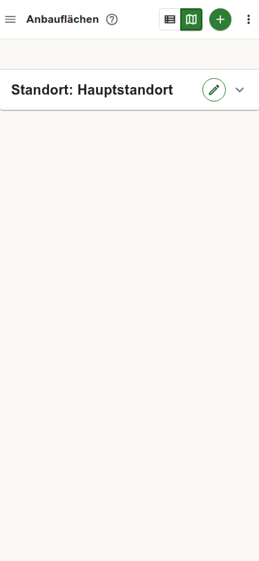

## Mobile Add Action Is Icon-Only and Context Is Unclear

Severity: Medium

Area: Mobile top bars

Reproduction Steps

1. Open areas, cultures, or planting plans on mobile.
2. Inspect the green `+` action in the top bar.

Expected Behavior

The action should communicate what will be added, particularly where several entities can be created.

Actual Behavior

The action is reduced to an unlabeled visual plus. On the areas page, users can create locations, parcels, and beds, so the intended target is not visually clear. The overflow menu contains project/account actions rather than the alternative area-creation actions.

Suggested Fix

Use a labeled mobile action, a contextual add menu, or a bottom sheet listing the available entity types.

**Status: 🚫 Won't Fix.**

Screenshot (if available)

## Column Action Uses English “Sort” Label

Severity: Low

Area: Planting plans / accessibility / localization

Reproduction Steps

1. Open the planting-plan table.
2. Inspect column-header controls with accessibility information.

Expected Behavior

The control should use a localized label such as “Sortieren”.

Actual Behavior

The visible control is exposed as `aria-label="Sort"` and `title="Sort"`.

Suggested Fix

Provide localized DataGrid slot text and audit remaining third-party defaults.

**Fix:** The existing `germanDataGridLocaleText` object in `components/data-grid/localeText.ts` now spreads the full MUI-provided `deDE` locale (imported from `@mui/x-data-grid/locales`) and overlays only the two app-specific strings (`noRowsLabel`, `noResultsOverlayLabel`). This brings in `columnHeaderSortIconLabel: 'Sortieren'` along with all other standard German labels (column menu, filter panel, pagination, etc.) in one change.

## Executive Summary

The core workflow is functional: a new user can register, activate, create a project, follow the dashboard checklist, build the location/parcel/bed hierarchy, import a culture, create a planting plan, and see it in the calendar. Empty states are generally strong and guide users toward valid prerequisites.

The largest risks are inconsistent editing semantics, keyboard focus behavior, and accessibility metadata. Two important edits can be lost without warning, while planting-plan edits silently save under the same navigation action. Several dense inline editors have unnamed controls. Mobile layouts avoid page-level horizontal overflow, but graphical areas and calendar content can appear blank or clipped.

No Critical issue was confirmed. Five High-severity issues were confirmed.

## Top 10 Most Important Issues

1. Similar inline editors silently use conflicting save/discard behavior.
2. Unsaved bed edits are lost on navigation.
3. Unsaved profile changes are lost on navigation.
4. Planting-plan editor controls have no accessible names.
5. Tab exits parcel creation instead of continuing row editing.
6. Imported culture notes expose raw internal citation markers.
7. Planting-plan dates use inconsistent US/German formatting.
8. Mobile calendar labels are clipped.
9. Graphical area views appear empty while collapsed.
10. Invalid dimension inputs are not programmatically marked invalid.

## Top 10 UX Improvements

1. Standardize explicit Save/Cancel and navigation protection.
2. Keep Tab/Shift+Tab inside active inline rows.
3. Add visible Save/Cancel actions to inline creation.
4. Expand the only graphical location by default.
5. Render culture sources as usable links or footnotes.
6. Use one localized date component everywhere.
7. Replace ambiguous mobile plus icons with contextual labels or menus.
8. Delay command-palette promotion until onboarding is complete.
9. Add field-level validation messages and focus management.
10. Preserve and communicate graphical-view expansion state.

## Top 10 Consistency Improvements

1. Use one save model across areas, planting plans, cultures, and settings.
2. Use German date formatting on desktop and mobile.
3. Localize all accessible labels, including Close, Open, Show password, and Sort.
4. Give all inline table controls names derived from their columns.
5. Use the same keyboard navigation model in all editable tables.
6. Use consistent visible actions for create/edit/delete.
7. Make graphical/list view state and expansion behavior predictable.
8. Use the same validation presentation for dialog and inline forms.
9. Standardize mobile add-action behavior across pages.
10. Use consistent source/citation rendering in library and project culture details.

## Features That Were Difficult To Discover

- Bed creation depends on a small row-level plus icon.
- Inline row Save/Cancel behavior is keyboard-only and undocumented.
- Context menus provide important copy/delete/duplicate actions.
- Version history is behind a culture-specific overflow menu and also appears ambiguously in the global command menu.
- Graphical content is hidden inside collapsed location accordions.
- Project and account settings live behind the global overflow menu.

## Features That Behaved Unexpectedly

- Planting-plan edits auto-save when navigating away.
- Bed and profile edits are discarded by the same navigation action.
- Tab leaves a parcel editor for the global top bar.
- Desktop dates display in US format while mobile dates are German.
- A populated graphical view can initially look empty.
- Mobile calendar content clips despite no page-level horizontal overflow.

## First-Time User Experience Assessment

Registration and activation are understandable. The local-development activation message accurately explains that no inbox delivery occurs, and activation logs the user in automatically.

The no-project screen and subsequent “Projektstart” checklist are effective. They explain the core sequence and update as parcel, bed, culture, and planting plan data are created. Empty states on cultures, planting plans, suppliers, calendar, and seed demand are generally actionable.

The experience becomes less predictable once inline table editing begins. Saving is often implicit, row actions rely on hover/context menus, and keyboard behavior varies. A first-time user can complete the workflow, but will need experimentation to understand editing and graphical views.

## Overall Application Rating

- Learnability: 7/10
- Usability: 6/10
- Consistency: 5/10
- Accessibility: 4/10
- Mobile Experience: 6/10
- Keyboard Navigation: 4/10

Overall: **5.5/10**

## Positive Findings

- Registration, activation, and automatic login completed successfully.
- The project-start checklist gives a useful workflow sequence.
- Empty states usually provide the next valid action.
- Escape cancels new parcel/project creation.
- Enter saves new parcel and bed names.
- Area-overflow validation clearly explains requested and available area.
- Supplier URL validation is localized and clear.
- Supplier deletion offers Undo.
- Culture library selection and import are understandable.
- The calendar correctly shows growth and harvest periods.
- Mobile pages avoid document-level horizontal overflow.
- Command palette and major shortcuts are discoverable and functional.

## Test Limitations

- The development environment uses console email delivery, so activation was completed from the locally generated activation URL rather than an external mailbox.
- Drag-and-drop calendar movement was visually inspected but not exhaustively exercised.
- Destructive project/account deletion was opened and reviewed but not finalized, to preserve the QA account and project for the complete workflow.
