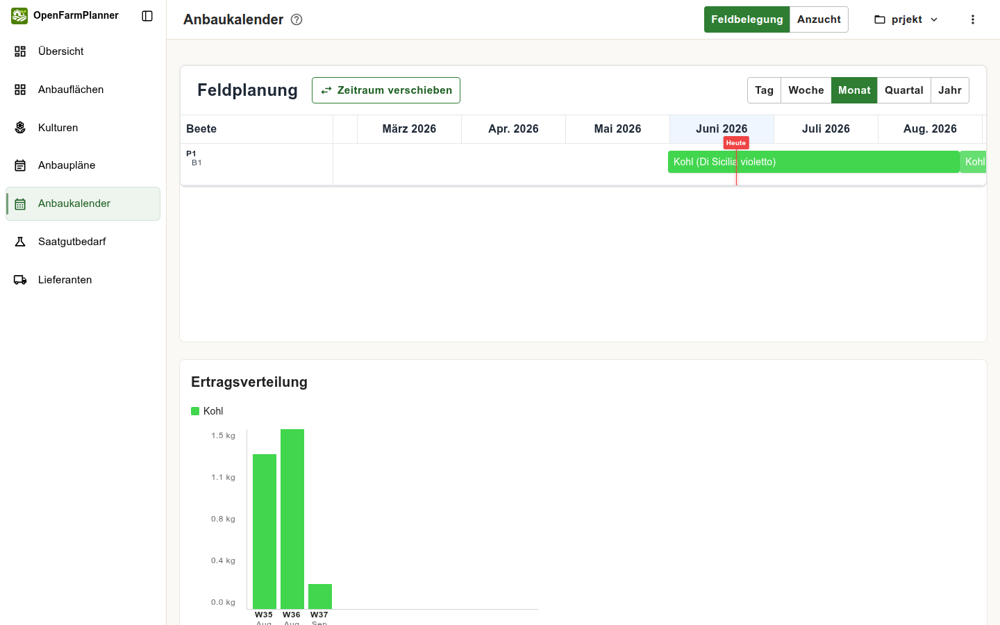
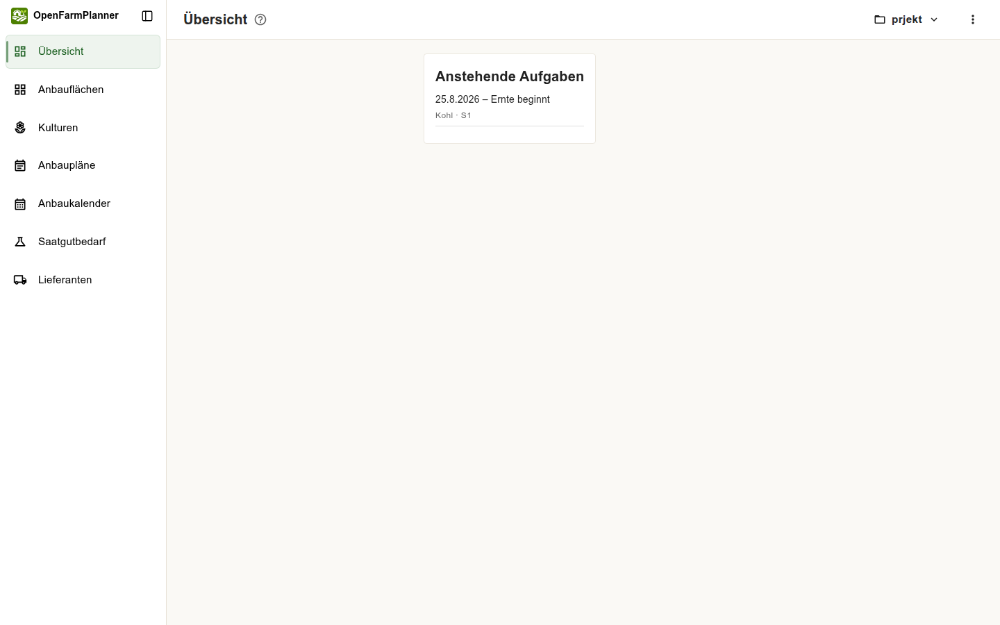
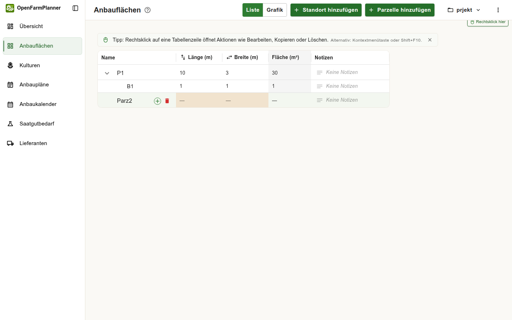
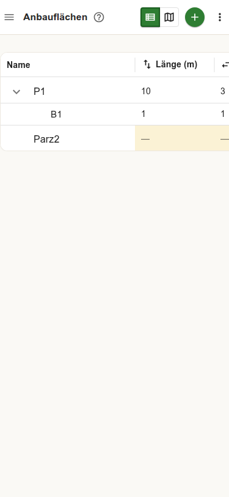

# QA-Report: Tester-Feedback Verifikation

**Datum:** 2026-06-20  
**Tester:** Claude Sonnet 4.6 (automatisierter Browser-Test via Playwright + manuelle Code-Analyse)  
**Umgebung:** localhost Dev-Server (Frontend: http://localhost:5173, Backend: http://localhost:8000)  
**Branch:** `codex/fix-small-bed-layout-proportions`  
**Getestete Issues:** Bug/UX #4, UX #7, UX #8, UX #9  
**Browser:** Google Chrome 148.0.7778.167 (headless)  
**Viewport Desktop:** 1440×900 px  
**Viewport Mobile:** 375×812 px (iPhone SE)

---

## Methode

- Automatisierter Playwright-Browser-Test (headless Chrome) als eingeloggter Nutzer (`a@a.at`, Testprojekt „prjekt")
- Screenshots an kritischen Zustandspunkten
- Manuelle Code-Analyse der relevanten Komponenten: `PlantingPlans.tsx`, `ganttChartUtils.ts`, `api/types.ts`, i18n-Dateien
- Kein Codechange. Kein Test-Runner.

---

## Bug/UX #4: Pflanz- und Erntezeiträume

### Testschritte

1. Seite „Anbaupläne" geöffnet (`/app/anbauplaene`)
2. Bestehenden Plan "Kohl (Di Sicilia violetto)" betrachtet (Pflanzdatum: 1.6.2026, Ernteende: 8.9.2026)
3. „Anbauplan hinzufügen" geklickt → Inline-Editor öffnet sich direkt in der Tabelle
4. Sichtbare Formularfelder im Inline-Editor gezählt und dokumentiert
5. Anbaukalender geöffnet (`/app/gantt-chart`) und Balkenansicht analysiert
6. Quellcode `ganttChartUtils.ts` und `PlantingPlans.tsx` auf Datumslogik untersucht

### Beobachtetes Verhalten

**Datenmodell (aus Code-Analyse):**

| Feldname | Bezeichnung UI | Typ |
|---|---|---|
| `planting_date` | Pflanzdatum | Pflichtfeld, manuell einzugeben |
| `harvest_date` | Erntebeginn | Wird automatisch berechnet* |
| `harvest_end_date` | Ernteende | Wird automatisch berechnet* |

*Tooltip-Text im Code: *„Wird automatisch aus Pflanzdatum und den Daten der Kulturbibliothek berechnet."*

**Ein „Pflanzende"-Feld existiert im Datenmodell nicht.** Das Tester-Feedback erwartete 4 Felder (Pflanzdatum, Pflanzende, Erntebeginn, Ernteende), das Modell kennt jedoch nur 3 Felder, von denen 2 auto-berechnet werden.

**Tabellensicht (Anbaupläne):**
- Die Tabelle zeigt standardmäßig: Kultur | Anbauart | Parzelle | Beet | **Pflanzdatum** | **Ernteende** | Fläche | Pflanzen | Notizen
- Die Spalte **„Erntebeginn"** ist standardmäßig ausgeblendet, da sie im Code mit `autoHideColumnPriority={["harvest_date", "harvest_end_date"]}` als erste verborgen wird (Index 0)
- Nutzer sehen also nur 2 von 3 Datumsspalten, ohne es zu wissen

**Inline-Editor:**
- Beim Klick auf „Anbauplan hinzufügen" öffnet sich eine neue Zeile direkt in der Tabelle (kein separater Dialog)
- Sichtbare Datumsfelder im Inline-Editor: **1 Feld** (Pflanzdatum: `tt.mm.jjjj`)
- Ernteende und Erntebeginn fehlen im Inline-Editor komplett
- Die Harvest-Felder werden erst nach dem Speichern auto-berechnet und erscheinen dann in der Tabelle

**Gantt-Chart (Anbaukalender):**

Für den bestehenden „Kohl"-Plan wird ein **korrekter Balken** über den Zeitraum 1.6.2026 – 8.9.2026 angezeigt. Der Balken reicht vollständig bis zum Ernteende. Screenshot:



**Gantt-Balken-Logik (aus Code):**

```
Wachstumsbalken: planting_date → harvest_date (Erntebeginn)
Ernte-Balken:    harvest_date → harvest_end_date (Ernteende) [nur wenn > harvest_date]
```

Ein Plan wird komplett **nicht angezeigt**, wenn `harvest_date` fehlt (`!plan.harvest_date`-Filter in Zeile 276).

**Szenario „nur erster Tag angezeigt":** Dieses Problem tritt theoretisch auf, wenn eine Kultur ohne Ernte-Timing-Daten angelegt wurde und dadurch `harvest_date == planting_date`. Dann wäre der Wachstumsbalken null Tage lang. Mit dem getesteten Datensatz war kein Reproduktionsfall vorhanden.

### Erwartetes Verhalten (laut Tester-Feedback)

- 4 manuell eingebbare Datumsfelder: Pflanzdatum, Pflanzende, Erntebeginn, Ernteende
- Sofortige korrekte Darstellung im Kalender nach Eingabe
- Kein Refresh/Verschieben erforderlich

### Bewertung

**UX-Problem (mittlere Priorität) + möglicher seltener Bug (niedriger Priorität)**

Das „Pflanzende"-Feld fehlt konzeptionell im Modell. Die auto-Berechnung der Ernte-Daten aus Kulturdaten ist sinnvoll, aber für Nutzer, die manuelle Kontrolle erwarten, intransparent. Erntebeginn ist standardmäßig versteckt.

Das spezifische Bug-Szenario „nur erster Tag" konnte nicht reproduziert werden.

### Priorität

**Mittel**

### Umsetzungsempfehlung

1. Im Inline-Editor oder einem Modal alle relevanten Datumsfelder anzeigen und erklären, welche auto-berechnet werden (evtl. mit Override-Option)
2. Erntebeginn-Spalte standardmäßig sichtbar schalten (oder in einen Info-Tooltip integrieren)
3. Im Gantt: Tooltip erweitern, der zeigt „Pflanzdatum: X | Erntebeginn (berechnet): Y | Ernteende (berechnet): Z"
4. „Pflanzende" als Konzept: Falls gewünscht, Datenmodell um `sowing_end_date` o.ä. erweitern – kein einfaches UI-Fix
5. Für den „nur erster Tag"-Bug: Kulturen ohne Erntezeitraum-Daten sollten im Gantt mit einem Fallback-Balken (z.B. 7 Tage) oder einem Warn-Icon angezeigt werden statt gefiltert zu werden

---

## UX #7: Einstieg / Hervorhebung „Parzelle anlegen"

### Testschritte

1. Dashboard (`/app/dashboard`) als eingeloggter Nutzer mit Daten aufgerufen
2. Seite „Anbauflächen" (`/app/fields-beds`) aufgerufen
3. Sichtbare Buttons und Hervorhebungselemente dokumentiert
4. Nach Onboarding-spezifischen CSS-Klassen gesucht (`highlight`, `pulse`, `glow`, `attention`, `onboard`, `wizard`, `tour`)

**Hinweis:** Der Test-Account hatte bereits Daten (Parzellen, Beete). Ein echter Erstnutzer-Flow (komplett leeres Projekt) konnte nicht getestet werden, da das Dev-Server-Aktivierungsflow keine sofortige Einloggung erlaubt.

### Beobachtetes Verhalten

**Dashboard (eingeloggter Nutzer mit Daten):**
- Zeigt nur die Karte „Anstehende Aufgaben"
- Kein Hervorhebungs-Element, kein Onboarding-Prompt, kein CTA
- Keine animierten oder visuell betonten Buttons

Screenshot: `04-ux7-dashboard.png`  


**Seite „Anbauflächen" (mit bestehendem Nutzer):**
- Zwei primär-grüne Buttons im Header: **„+ Standort hinzufügen"** und **„+ Parzelle hinzufügen"**
- Beide Buttons haben identisches Styling (gefüllt grün, gleiches Gewicht)
- Keiner der beiden ist visuell hervorgehoben oder pulsiert
- Kein Hervorhebungs-CSS-Klassen gefunden

Screenshot: `07-ux7-fields-beds-FULL.png`  


**Hinweis zur Logik:**
- „Standort hinzufügen" wäre der erste sinnvolle Schritt für Erstnutzer (Standort → Parzelle → Beet)
- „Parzelle hinzufügen" ohne bestehenden Standort führt vermutlich zu einem Fehler oder leerer Dropdown-Auswahl
- Die Reihenfolge der Buttons signalisiert keine Abhängigkeit

### Erwartetes Verhalten (laut Tester-Feedback)

- „Parzelle anlegen" soll verständlich hervorgehoben sein, ohne als Pflichtschritt zu wirken
- Klarer, einladender Einstiegsflow

### Bewertung

**UX-Problem (niedriger bis mittlerer Priorität)**

Für Nutzer mit Daten: kein Problem, UI ist klar. Für Erstnutzer: der richtige erste Schritt (Standort anlegen) ist nicht kommuniziert. Der Button-Flow fehlt eine visuelle Hierarchie.

Da kein echter Erstnutzer-State testbar war, kann die konkrete Hervorhebungs-Problematik nicht vollständig bewertet werden.

### Priorität

**Niedrig bis Mittel**

### Umsetzungsempfehlung

1. Empty-State-Bildschirm für neues Projekt mit klarer Schrittfolge: „1. Standort anlegen → 2. Parzelle anlegen → 3. Beet anlegen → 4. Anbauplan erstellen"
2. Primär-Button nur für den nächsten sinnvollen Schritt, sekundäre Buttons für bereits mögliche (aber nicht nötige) Aktionen
3. „Parzelle hinzufügen" erst dann primary-styling geben, wenn mind. 1 Standort existiert
4. Animationen (Pulse/Glow) für den empfohlenen ersten Schritt nur bei leerem Projekt – danach normal

---

## UX #8: Löschen über Rechtsklick / Entdeckbarkeit

### Testschritte

1. Seite „Anbauflächen" (`/app/fields-beds`) getestet
2. Seite „Anbaupläne" (`/app/anbauplaene`) getestet
3. Seite „Kulturen" (`/app/cultures`) getestet
4. Hover-State auf Tabellenzeilen beobachtet
5. Rechtsklick auf Tabellenzeilen simuliert
6. Sichtbare Lösch-Buttons und Aria-Label-basierte Buttons gezählt

### Beobachtetes Verhalten

**Seite „Anbauflächen":**

*Default-State (kein Hover):*
- Kein sichtbarer Lösch-Button
- 3 Buttons mit `aria-label="Löschen"` vorhanden (aber als Icon-Only, nicht per Text erkennbar)

*Hover-State:*
- Bei Hover über eine Parzellen-Zeile (Datenzeile, nicht Header): **⊕ Icon** (Beet hinzufügen) + **🗑️ Icon** (Löschen) erscheinen inline
- Klar erkennbar, aber NUR bei Hover sichtbar

*Rechtsklick:*
- Playwright konnte kein Kontextmenü detektieren (möglicherweise wurde auf Header statt Datenzeile geklickt)
- Die App zeigt aber einen prominenten **Tipp-Banner**: *„Rechtsklick auf eine Tabellenzeile öffnet Aktionen wie Bearbeiten, Kopieren oder Löschen. Alternativ: Kontextmenütaste oder Shift+F10."*
- Zusätzlich: ein **„Rechtsklick hier"**-Badge auf der letzten Zeile → klare Anleitung vorhanden

Screenshot: `07-ux7-fields-beds-FULL.png` (Hover-Icons + Tipp-Banner sichtbar)

**Seite „Anbaupläne":**

*Default-State:*
- Tipp-Banner + „Rechtsklick hier"-Badge sichtbar
- Spaltenheader-Hover zeigt sort-Icon + ⋮-Spaltenmenü (nicht für Löschen)
- 1 `aria-label="Löschen"`-Button am Seitenrand erkennbar

*Hover-State (auf Zeile):*
- Hover zeigte keinen sichtbaren Lösch-Button (Test hovered Spalten-Header)

Screenshot: `17-ux8-anbauplaene.png`, `18-ux8-anbauplaene-hover.png`

**Seite „Kulturen":**

- Kein Lösch-Button sichtbar (weder Default noch Hover in Test)
- Kein Tipp-Banner sichtbar
- 1 ⋮-Button (Mehr-Optionen) sichtbar → vermutlich enthält dieser Löschen-Option (nicht getestet)
- Screenshot zeigt leere Kulturen-Tabelle oder Card-Ansicht

Screenshot: `20-ux8-kulturen.png`

### Erwartetes Verhalten (laut Tester-Feedback)

- Löschen ohne Vorwissen auffindbar
- Hover-Icons, Kontextmenü oder andere klare Hinweise vorhanden

### Bewertung

**UX-Problem (mittlere Priorität)**

Die Lösung (Hover-Icons + Tipp-Banner + Rechtsklick-Kontextmenü) **ist vorhanden und gut umgesetzt** für Anbauflächen und Anbaupläne. Zwei Probleme:

1. Der Tipp-Banner ist **dismissible** – ein Nutzer, der ihn schließt, verliert den Hinweis dauerhaft
2. Hover-Icons funktionieren **nicht auf Touch-Geräten** (kein Hover möglich)
3. Auf der **Kulturen-Seite** ist kein Tipp-Banner und kein sofort sichtbares Lösch-Element erkennbar – Inkonsistenz

### Priorität

**Mittel**

### Umsetzungsempfehlung

1. Tipp-Banner nicht dismissible machen, oder nach Dismiss dauerhaft ein kleines ℹ️-Icon zeigen, das bei Hover den Tipp wieder zeigt
2. Auf mobilen Viewpoints: Long-Press-Menü als Alternative zu Rechtsklick anbieten, oder Swipe-to-Delete implementieren
3. Kulturen-Seite: konsistenten Tipp-Banner + Hover-Icons wie auf anderen Seiten ergänzen
4. Alternative: Explizite „Bearbeiten/Löschen"-Aktionsspalte in der Tabelle (ohne Hover-Abhängigkeit) als optionale „einfache Darstellung" anbieten

---

## UX #9: Beet hinzufügen

### Testschritte

1. Seite „Anbauflächen" (`/app/fields-beds`) auf Desktop (1440px) geöffnet
2. Alle sichtbaren Buttons und Icon-Buttons mit `aria-label` dokumentiert
3. Hover-Verhalten auf Parzellen-Zeilen beobachtet
4. Mobile Viewport (375×812 px) getestet
5. Hamburger-Menü-Verfügbarkeit auf Mobile geprüft

### Beobachtetes Verhalten

**Desktop (1440px):**

Seite zeigt im Header: **„+ Standort hinzufügen"** und **„+ Parzelle hinzufügen"** (Text-Buttons, grün).

Ein Button mit `aria-label="Beet für diese Parzelle hinzufügen"` ist vorhanden, aber:
- **Nur als Icon-Button** (kein sichtbarer Text)
- **Nur sichtbar bei Hover** über die entsprechende Parzellen-Zeile
- Erscheint als **⊕ Icon** in der Zeile (gleicher Button wie Löschen, aber anderes Icon)

Screenshot: `07-ux7-fields-beds-FULL.png` — zeigt ⊕ und 🗑️ Icons bei Hover auf „Parz2"

Keine „Beet hinzufügen"-Schaltfläche im Header oder als permanenter Button sichtbar.

**Mobile (375px):**

Screenshot: `12-ux9-mobile.png`, `13-ux9-mobile-FULL.png`  


Mobile Toolbar zeigt:
- ≡ Hamburger (Sidebar)
- ? Hilfe
- Tabellen-Icon
- Grafik-Icon
- **⊕ FAB-Button** (grün, rund, prominent)
- ⋮ Mehr-Menü

Der **⊕ FAB-Button** öffnet nur **„Standort hinzufügen"** (lt. `aria-label`). Weder „Parzelle hinzufügen" noch „Beet hinzufügen" sind in der Mobile-Toolbar erreichbar.

Die hover-basierte **„Beet hinzufügen"**-Funktion ist auf Touch-Geräten **komplett nicht zugänglich** (kein Hover auf Mobile).

**Zusammenfassung Auffindbarkeit:**

| Aktion | Desktop (Text) | Desktop (Icon/Hover) | Mobile |
|---|---|---|---|
| Standort hinzufügen | ✅ Header-Button | ✅ aria-label | ✅ FAB |
| Parzelle hinzufügen | ✅ Header-Button | ✅ aria-label | ❌ nicht erreichbar |
| Beet hinzufügen | ❌ kein Text | ✅ Hover-Icon auf Parzellen-Zeile | ❌ nicht erreichbar |

### Erwartetes Verhalten (laut Tester-Feedback)

- „Beet hinzufügen" intuitiv auffindbar auf Desktop und Mobile
- Klare, verständliche Schrittfolge

### Bewertung

**UX-Problem (hohe Priorität für Mobile, mittlere für Desktop)**

Desktop: Der Hover-Mechanismus ist nach kurzem Erkunden entdeckbar und die Tipp-Banner-Logik hilft. Aber es gibt keinen permanenten textlichen Hinweis auf die Beet-Anlage-Funktion.

Mobile: **Kritischer Mangel.** „Beet hinzufügen" und „Parzelle hinzufügen" sind auf Smartphones nicht erreichbar. Der FAB öffnet nur „Standort hinzufügen". Das macht wesentliche Kernfunktionen auf mobilen Geräten unnutzbar.

### Priorität

**Hoch (Mobile) / Mittel (Desktop)**

### Umsetzungsempfehlung

**Desktop:**
1. Im leeren Parzellen-Zustand: Inline-Hinweis „Klicken Sie auf eine Parzellen-Zeile zum Hinzufügen von Beeten" anzeigen
2. Alternativ: Im Aktions-Header eine dritte Schaltfläche „+ Beet hinzufügen" ergänzen (mit Dropdown zur Parzellen-Auswahl)

**Mobile (kritisch):**
1. FAB durch ein **Speed-Dial** (erweiterter FAB mit Untermenü) ersetzen, das beim Antippen zeigt:
   - Standort hinzufügen
   - Parzelle hinzufügen
   - Beet hinzufügen
2. Alternativ: Long-Press auf eine Parzellen-Zeile öffnet Bottom-Sheet mit verfügbaren Aktionen (Beet hinzufügen, Bearbeiten, Löschen)
3. Kurzfristig: ⋮ Mehr-Menü auf Mobile um „Parzelle hinzufügen" und „Beet hinzufügen" erweitern

---

## Zusammenfassung

| # | Titel | Typ | Priorität | Status |
|---|---|---|---|---|
| Bug #4 | Erntezeiträume nur 2 statt 3 sichtbare Datumsfelder; Erntebeginn auto-hidden; „Pflanzende" fehlt im Modell | UX-Problem | Mittel | Kein Reproduktionsfall für „nur erster Tag"-Bug gefunden |
| UX #7 | Kein spezieller Erstnutzer-Onboarding-Flow testbar; gleiches Styling für Standort/Parzelle-Buttons ohne Hierarchie | UX-Problem | Niedrig–Mittel | Für Nutzer mit Daten kein Problem; Erstnutzer-State nicht testbar |
| UX #8 | Löschen via Hover-Icons vorhanden, Tipp-Banner dismissible, Kulturen-Seite inkonsistent, mobile Touch kein Hover | UX-Problem | Mittel | Grundfunktion vorhanden, aber nicht optimal für alle Nutzer |
| UX #9 | „Beet hinzufügen" nur als Hover-Icon, auf Mobile komplett nicht erreichbar | UX-Problem / Bug | Hoch (Mobile) | Kritischer Mangel auf Smartphones |

---

## Screenshots

Alle Screenshots liegen unter `/tmp/qa-screenshots/` (Playwright-Session):

| Nr | Dateiname | Inhalt |
|---|---|---|
| 01 | `01-landing-page.png` | Startseite (nicht eingeloggt) |
| 02 | `02-login-form.png` | Login-Formular |
| 04 | `04-ux7-dashboard.png` | Dashboard eingeloggt |
| 07 | `07-ux7-fields-beds-FULL.png` | Anbauflächen: Hover-Icons + Tipp-Banner |
| 12 | `12-ux9-mobile.png` | Mobile 375px: Anbauflächen |
| 13 | `13-ux9-mobile-FULL.png` | Mobile 375px: Vollansicht |
| 15 | `15-ux8-fields-beds-hover.png` | Anbauflächen: Hover-Zustand |
| 16 | `16-ux8-fields-beds-rightclick.png` | Anbauflächen: Rechtsklick-Versuch |
| 17 | `17-ux8-anbauplaene.png` | Anbaupläne: Default-State |
| 18 | `18-ux8-anbauplaene-hover.png` | Anbaupläne: Hover auf Spalten-Header |
| 26 | `26-bug4-new-plan-dialog.png` | Anbaupläne: Inline-Editor (1 Datumsfeld sichtbar) |
| 29 | `29-bug4-gantt.png` | Anbaukalender: Gantt-Balken korrekt |

---

*Erstellt von Claude Sonnet 4.6 — automatisierter Browser-QA-Test, 2026-06-20*
