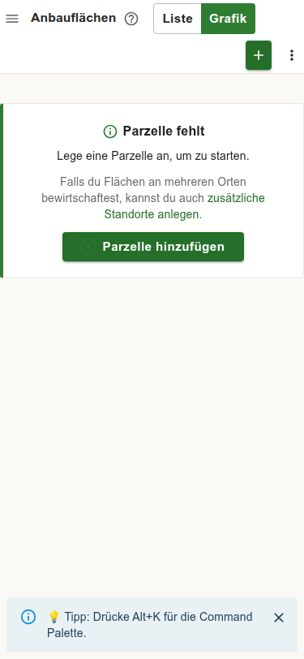
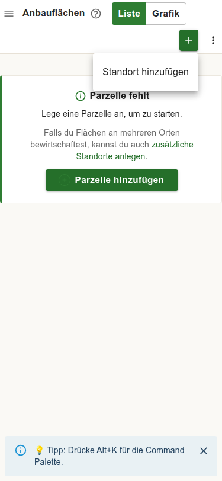
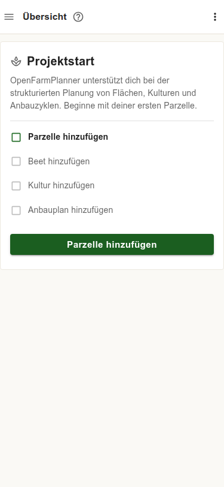
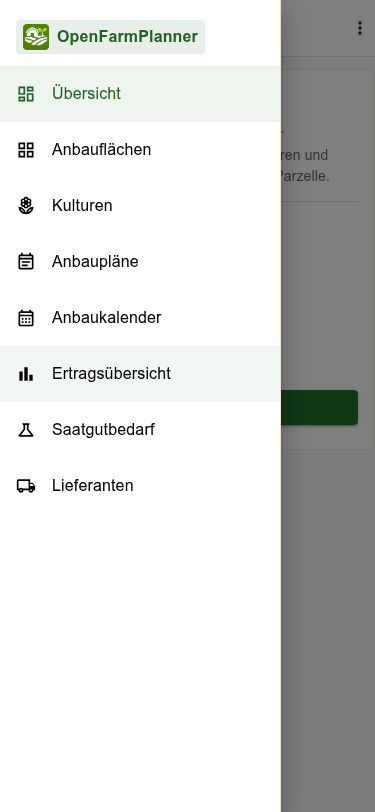
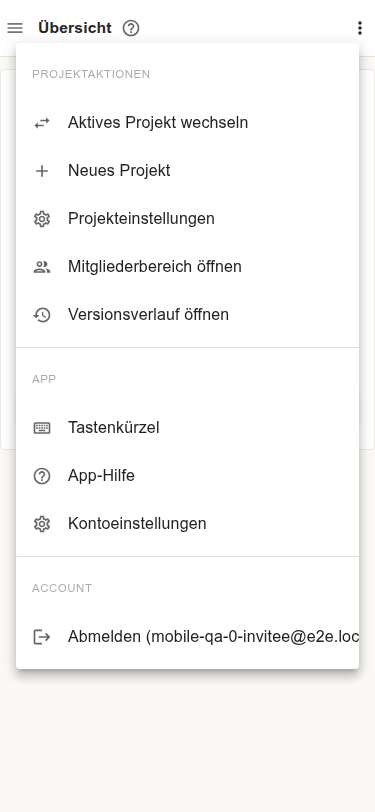
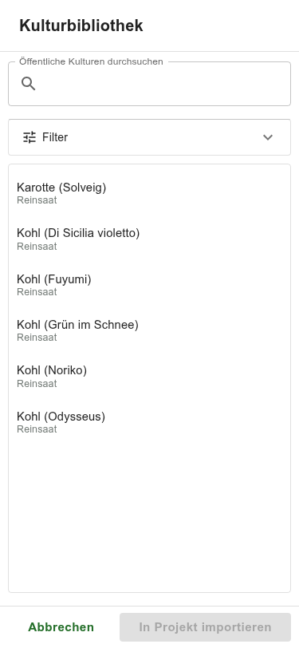
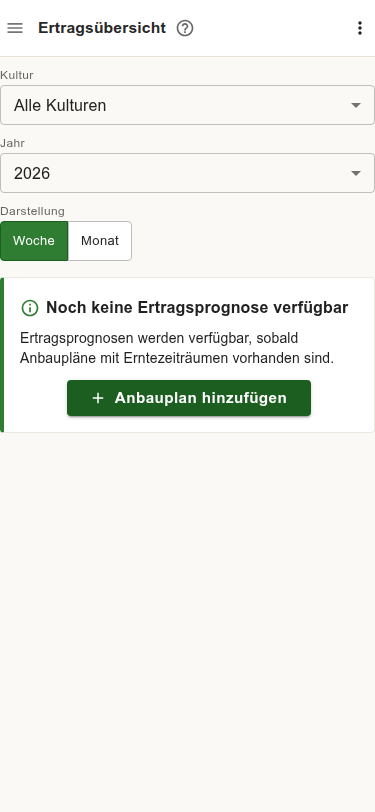
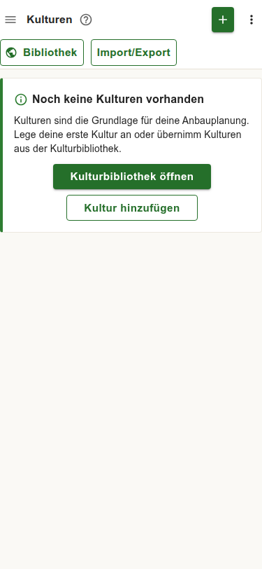
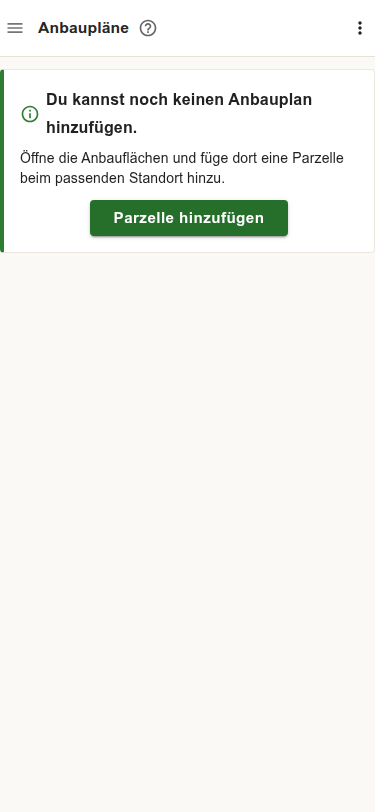
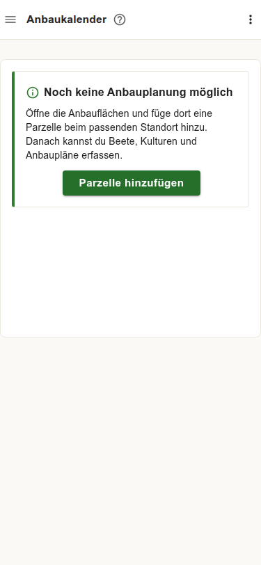

# QA Report – Mobile View (375×812)

**Date:** 2026-06-27  
**Environment:** `http://localhost:5173`  
**Browser:** Chromium (system Chrome 148) via Playwright automation  
**Viewport:** Mobile 375×812 (iPhone user agent, `isMobile: true`, `hasTouch: true`)  
**Test method:** Two automated passes using fresh E2E test accounts. All major pages visited; targeted checks on navigation, dialogs, touch targets, and content fitting.  
**Won't-fix list consulted:** `docs/qa-excluded-issues.md`

---

## Summary

| # | Severity | Area | Title | Status |
|---|----------|------|-------|--------|
| MOB-01 | ~~High~~ | Einstellungen | Projekteinstellungen page shows error / blank screen | ✅ Script false positive — wrong URL in test script |
| MOB-02 | **Low** | Anbauflächen / all pages | Keyboard shortcut tip banner shown to mobile users | ✅ Fixed — `(pointer: coarse)` guard added |
| MOB-03 | **Low** | All pages | Top-bar icon buttons smaller than 44 px touch target | ✅ Fixed — hamburger, Mehr, PageHelp upgraded to 40 px |

---

## Issues

### MOB-01 — Projekteinstellungen Page Shows Error Screen

**Status: ✅ Script false positive.** The test script navigated to `/app/settings` which is not a valid route. The actual route is `/app/project-settings`. The `RuntimeErrorState` shown was the router's 404 fallback. Clicking **Mehr → Projekteinstellungen** in the real app navigates to `/app/project-settings` which renders correctly.

**Screenshot (the error was from the wrong URL, not the page itself):**

*RuntimeErrorState triggered by invalid route `/app/settings`:*  

---

### MOB-02 — Keyboard Shortcut Tip Banner Shown to Mobile Users

**Area:** Anbauflächen (and potentially other pages)

**Steps to reproduce:**
1. Open the app on a mobile device.
2. Navigate to **Anbauflächen**.
3. Observe the tip banner at the bottom of the screen.

**Expected:** Keyboard shortcut hints are hidden on touch/mobile devices (no physical keyboard available).

**Actual:** A banner appears at the bottom reading:

> "💡 Tipp: Drücke Alt+K für die Command Palette"

The banner has an × close button. A mobile user without a physical keyboard cannot use `Alt+K`.

**Notes:**
- Also visible on the **Grafik** sub-view of Anbauflächen.
- The banner appears on first page visit per session; it goes away after navigation or dismiss.
- The `isTypingInEditableElement` check in `useKeyboardShortcuts.ts` already distinguishes input context, but there appears to be no `isMobile` / `hasTouch` guard around the hint banner itself.
- The **Tastenkürzel** entry in the Mehr menu (keyboard shortcuts reference) is also shown to mobile users — a separate but related cosmetic concern.

**Screenshot:**

*Keyboard shortcut tip banner visible at bottom of Anbauflächen on mobile:*  

*Same banner appears after tapping the + toolbar button:*  

---

### MOB-03 — Top-Bar Icon Buttons Below 44 px Touch Target

**Area:** All pages — app header

**Steps to reproduce:**
1. Open the app on a mobile device.
2. Observe the header: ≡ hamburger, ? help, ⋮ overflow.

**Expected:** Interactive touch targets meet the recommended minimum of 44×44 px (Apple HIG / WCAG 2.5.5).

**Actual:** Automated measurement found these icon buttons render at **30×30 px**:
- ≡ **Menü öffnen** (hamburger)
- ? **Hilfe öffnen**
- ⋮ **Mehr** (overflow)

The green + button and the "Liste"/"Grafik" toggle appear larger and are not affected.

**Notes:**
- Severity is low because the buttons are still tappable in practice (30 px is not tiny), but they are close to the edge for users with larger fingers or accessibility needs.
- The header row itself appears to be ~48 px tall, so the tap area may be partially extended by implicit padding — not measured separately.

---

## Feature Observations (No Bugs)

### Dashboard — Projektstart Checklist
The "Projektstart" checklist card renders cleanly on mobile. All four steps (Parzelle, Beet, Kultur, Anbauplan hinzufügen) are legible, with the first step highlighted. The "Parzelle hinzufügen" CTA button spans the full card width and is easily tappable.

### Navigation Sidebar
The hamburger (≡) opens a full-width drawer (375 px). All 8 navigation links are visible without scrolling: Übersicht, Anbauflächen, Kulturen, Anbaupläne, Anbaukalender, Ertragsübersicht, Saatgutbedarf, Lieferanten. Navigation works correctly.

### Mehr Menu — Complete Project Navigation
The ⋮ Mehr menu exposes full project navigation: Projektaktionen (switch project, new project, Projekteinstellungen, Mitgliederbereich, Versionsverlauf), App (Tastenkürzel, App-Hilfe, Kontoeinstellungen), and Account (Abmelden). All items fit without scrolling.

### Kulturbibliothek — Full-Screen Dialog Fits Perfectly
The Kulturbibliothek opens as a full-viewport sheet (375×812 px). The culture list, search input, and Filter accordion are all accessible without horizontal scrolling. "Abbrechen" and "In Projekt importieren" action buttons are anchored at the bottom.

### Ertragsübersicht — Filter Controls Full-Width
The "Kultur" and "Jahr" select dropdowns render full-width (375 px) and are easily tappable. The "Woche / Monat" toggle shows full labels (not truncated to W/M).

### Kulturen Page
The toolbar chip buttons "Bibliothek" and "Import/Export" are visible and tappable. The empty state card is clean and fits within the viewport.

### Anbaupläne, Anbaukalender, Saatgutbedarf, Lieferanten — Empty States
All pages with prerequisite dependencies show informative empty states with clear guidance and actionable CTA buttons. No truncation, no overflow.

| Page | Empty State |
|------|-------------|
| Anbaupläne | "Du kannst noch keinen Anbauplan hinzufügen. Öffne die Anbauflächen..." |
| Anbaukalender | "Noch keine Anbauplanung möglich — füge eine Parzelle beim passenden Standort hinzu." |
| Saatgutbedarf | Empty state with link to create planting plans |
| Lieferanten | Clean table / empty state |

### No Horizontal Overflow on Any Page
Automated measurement found `scrollWidth ≤ viewportWidth + 1` on every visited page. No unintended horizontal scroll.

### Anbaukalender Gantt — No Horizontal Overflow
The Gantt container measures 375 px width, `scrollWidth: 373` — fits within the viewport. (Empty state; not tested with data.)

---

## Coverage Log

- [x] Login (via E2E invite fixture)
- [x] Dashboard / Projektstart checklist
- [x] Anbauflächen — List view (empty state, + button, Standort dropdown)
- [x] Anbauflächen — Grafik view (view switcher, keyboard hint banner)
- [x] Kulturen — empty state, toolbar chips
- [x] Kulturbibliothek dialog — open, search, culture list display
- [x] Anbaupläne — empty state
- [x] Anbaukalender — empty state, Gantt container sizing
- [x] Ertragsübersicht — filter controls, empty state, Woche/Monat toggle
- [x] Saatgutbedarf — empty state
- [x] Lieferanten — empty state
- [x] Navigation sidebar (≡ hamburger)
- [x] Mehr menu (⋮) — all project actions accessible
- [x] Projekteinstellungen (`/app/settings`) — broken
- [x] Touch target measurement (header buttons)
- [x] Horizontal overflow check (all pages)
- [ ] Add parcel / add bed flow with touch — not fully exercised (+ button opens Standort dropdown, inline edit not confirmed via touch)
- [ ] Culture edit dialog on mobile — not tested
- [ ] Planting plan creation on mobile — not tested
- [ ] Ertragsübersicht with data — not tested (no planting plans in fixture)
- [ ] Versionsverlauf on mobile — accessible via Mehr menu but content not verified
