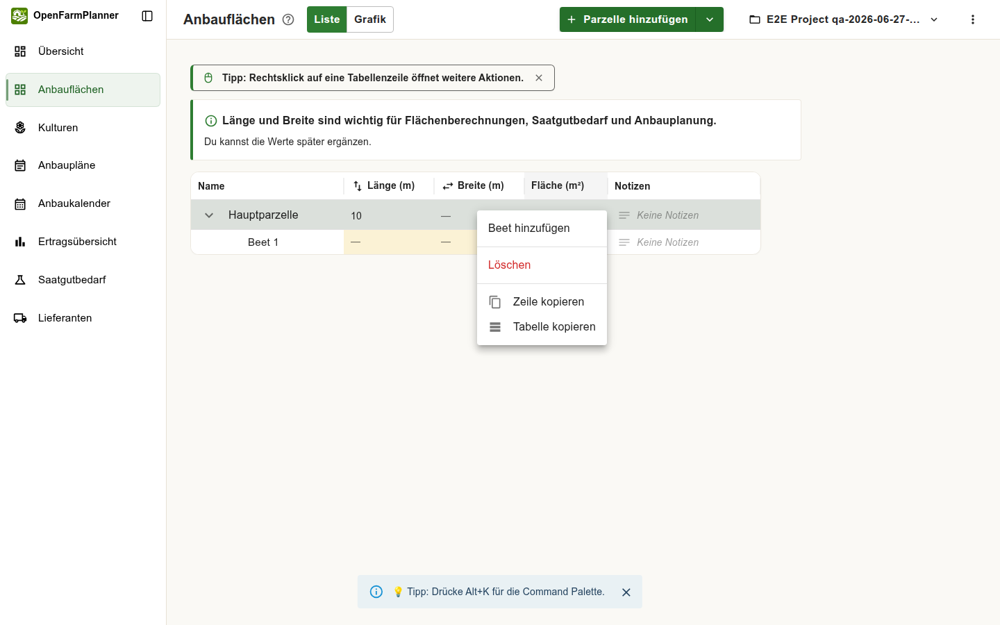
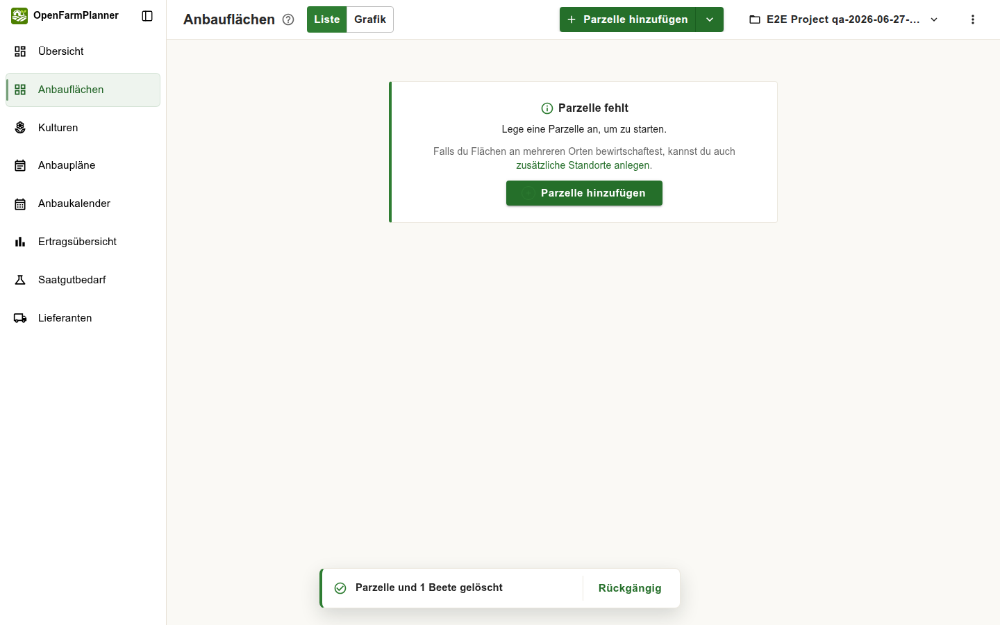

# QA Report – OpenFarmPlanner

**Date:** 2026-06-27  
**Environment:** `http://localhost:5173`  
**Browser:** Chromium (system Chrome 148) via standalone Playwright automation  
**Viewports:** Desktop 1440×900, Mobile 375×812  
**Test method:** Three exploratory passes using a fresh E2E test account. Each pass built up parcel, bed, culture, planting plan, and supplier data then tested all major flows.  
**Won't-fix list consulted:** `docs/qa-excluded-issues.md`

---

## Summary

| # | Severity | Area | Title | Status |
|---|----------|------|-------|--------|
| REG-01 | **High** | Anbauflächen | Parcel/bed delete has no confirmation dialog — only undo snackbar | ✅ Intentional — undo timeout extended to 10 s |
| NEW-01 | **Low** | Kulturbibliothek | Library preview renders Markdown headings as raw `###` text | ✅ Fixed — preview now uses ReactMarkdown with the same renderer as CultureDetail |

---

## Regression

### REG-01 — Parcel/Bed Delete: No Confirmation Dialog

**Area:** Anbauflächen – context menu delete

**Steps to reproduce:**
1. Open Anbauflächen.
2. Add a parcel and a bed.
3. Right-click the parcel row → "Löschen".

**Expected:** A confirmation dialog should appear before deletion (as per BUG-01 fix, commit `2941e795` "refactor: centralize confirmation prompts").

**Actual:** The parcel and all its beds are deleted immediately without any dialog. An undo snackbar appears at the bottom: **"Parzelle und 1 Beete gelöscht | Rückgängig"**.

**Resolution:** Confirmed intentional — the snackbar replaces the confirmation dialog. Undo timeout extended from 8 s to 10 s (`DELETE_UNDO_DURATION_MS` in `DeleteUndoSnackbar.tsx`). Project-wide version history is available as a further safety net.

**Screenshots:**

*Before delete — context menu visible:*

*After delete — undo snackbar, page shows empty state:*

---

## New Issues

### NEW-01 — Culture Library Preview Renders Markdown Headings as Raw Text

**Status: ✅ Fixed.** The notes `Typography` in `PublicCultureLibraryDialog.tsx` was replaced with a `ReactMarkdown` + `remarkGfm` renderer using the same styling as `CultureDetail`. The preview now renders headings, lists, and emphasis correctly, consistent with the imported culture view.

---

## Regression Checks — Previously Fixed Bugs

All previously fixed bugs were verified not regressed:

| Bug | Description | Result |
|-----|-------------|--------|
| BUG-01 | Delete without confirmation | ❓ See REG-01 above |
| BUG-05 | "Ungespeicherte Änderungen" badge on immediate open | ✅ Not regressed |
| BUG-06 | Bed rectangles without labels in grafik view | ✅ Not regressed |
| BUG-12 | New planting plan row appears at top | ✅ Not regressed — row appears at bottom |
| BUG-13 | Version history entries for deletions have no element name | ✅ Not regressed — shows e.g. "Parzelle „Hauptparzelle" gelöscht" |
| BUG-18 | Duplicate shortcut label in shortcuts dialog | ✅ Not regressed |
| Citation markers | `【…】` markers visible in culture notes | ✅ Not visible in library preview or imported culture |
| Date format | US-format dates in planting plan table | ✅ Date input shows `TT.MM.JJJJ` placeholder; rendered as `15.04.2026` |
| BUG-11 | Newest version history entry has no restore button | ✅ Not regressed — "Aktuelle Version" badge on newest, "Version wiederherstellen" on older entries |

---

## Feature Observations (No Bugs)

### Dashboard — Projektstart Checklist
The "Projektstart" checklist on the Übersicht page shows all four onboarding steps (Parzelle, Beet, Kultur, Anbauplan hinzufügen) with checkbox indicators. Steps become checked/highlighted as data is added. Onboarding flow is clear and actionable.

### Version History
Accessible via the ⋮ menu → "Versionsverlauf öffnen". Shows correct entries with element names, timestamps, and user attribution. Older entries have "Version wiederherstellen" buttons; the current version shows "Aktuelle Version" badge without a restore button (correct). The deleted parcel entry correctly reads "Parzelle „Hauptparzelle" gelöscht".

### Kulturen — New Side-Panel Layout
The culture page now shows a detail panel on the right when a culture is selected. The panel renders sections cleanly: Allgemeine Informationen, Zeitplanung, Abstände, Saatgut, Lieferant, Ernte. The imported "Karotte (Solveig)" shows an "Importiert" badge. Three action icons (edit pencil, tractor shortcut to planting plan, 3-dot menu) appear in the panel header.

### Bed Row — Tractor Shortcut Icon
Each bed row in the Anbauflächen list shows a 🚜 tractor icon on hover. Hovering reveals the tooltip "Anbauplan hinzufügen", providing a quick shortcut to create a planting plan for that specific bed. This is a useful discoverability feature.

### Empty States
All empty states were clear and provided actionable next steps:
- Anbauflächen: "Parzelle fehlt — Lege eine Parzelle an, um zu starten."
- Anbaukalender: "Noch keine Anbauplanung möglich — füge eine Parzelle hinzu."
- Saatgutbedarf: "Noch kein Saatgutbedarf berechenbar — Erstelle als Nächstes einen Anbauplan."
- Ertragsübersicht: "Noch keine Ertragsprognose verfügbar — sobald Anbaupläne mit Erntezeiträumen vorhanden sind."

### Keyboard Shortcuts
- `?` opens the shortcuts dialog. No duplicate labels (BUG-18 not regressed).
- `Alt+K` opens the command palette.
- `L` switches Anbauflächen to list view.
- `G` switches Anbauflächen to grafik view.
- All shortcuts functioned correctly.

### Right-Click Discovery
The info banner "Tipp: Rechtsklick auf eine Tabellenzeile öffnet weitere Aktionen." was visible on the Anbauflächen page. Context menus appeared on right-click and included appropriate actions per row type (parcel: Beet hinzufügen, Löschen, Zeile kopieren, Tabelle kopieren).

### Planting Plan Date Input
The Pflanzdatum field shows a German-format placeholder `TT.MM.JJJ` and accepts input in `15.04.2026` format. The previously reported US-format issue is confirmed fixed.

---

## Coverage Log

- [x] Login via invitation
- [x] Dashboard / Projektstart checklist
- [x] Anbauflächen — list view (add parcel, add bed, right-click menu, delete)
- [x] Anbauflächen — Grafik view (L/G shortcuts confirmed working)
- [x] Kulturen — culture library (open, select, preview, import)
- [x] Kulturen — imported culture detail panel
- [x] Anbaupläne — new row, date input format, row position
- [x] Anbaukalender — desktop and mobile (empty states)
- [x] Ertragsübersicht — filter controls, empty state
- [x] Saatgutbedarf — empty state
- [x] Versionsverlauf — open, entries, restore buttons
- [x] Overflow menu (⋮) navigation
- [x] Keyboard shortcuts (?, Alt+K, L, G)
- [x] Mobile viewport (375×812) — all main pages
- [ ] Culture edit dialog (BUG-04/BUG-05 dirty-state regression) — *not fully verified; edit dialog could not be opened via Playwright in the current culture layout*
- [ ] Lieferanten — add/edit/delete with hover icons — *not verified; supplier creation dialog locator failed in automation*
- [ ] Account settings navigation blocker — *not fully verified due to Chrome page-restore behavior in automated session*

---

## Positive Findings

- Dashboard Projektstart checklist guides new users effectively.
- All empty states are informative and include actionable next steps.
- Culture library shows no citation markers.
- Version history renders element names correctly for all operation types.
- Date input uses German locale throughout planting plans.
- Keyboard shortcuts are complete and functional.
- Right-click discovery banner appears contextually.
- The new culture side-panel layout presents imported culture data in an organized, readable format.
- The tractor shortcut icon on bed rows is a useful discoverability improvement.
